# Research Agent System - Complete Flow Documentation

**Version:** 2.0.0
**Date:** 2025-01-09
**Status:** Production-Ready (ROI Model Architecture)

---

## Table of Contents

1. [Overview](#1-overview)
2. [13 ROI Model Types](#2-13-roi-model-types)
3. [System Architecture](#3-system-architecture)
4. [WebSearchAgent](#4-websearchagent)
5. [DocumentAnalysisAgent](#5-documentanalysisagent)
6. [API Layer](#6-api-layer)
7. [Validation Pipeline](#7-validation-pipeline)
8. [Data Models](#8-data-models)
9. [Component Specifications](#9-component-specifications)
10. [Configuration & Setup](#10-configuration--setup)
11. [Example Usage](#11-example-usage)

---

## 1. Overview

### System Purpose

The Research Agent System provides two specialized AI agents for **ROI Model Data Extraction** in the Triton platform. These agents extract quantitative financial metrics, variables, and formulas that enable mathematical ROI calculations rather than qualitative value propositions.

- **WebSearchAgent**: Researches healthcare companies to extract ROI Model data (cost savings, metrics, formulas)
- **DocumentAnalysisAgent**: Analyzes ROI Story documents (PDF, DOCX, TXT) from S3 to extract ROI Model components

Both agents use Claude Sonnet 4 via AWS Bedrock with a sophisticated 4-layer validation pipeline and automatic retry logic.

### Architectural Shift: Value Propositions → ROI Models

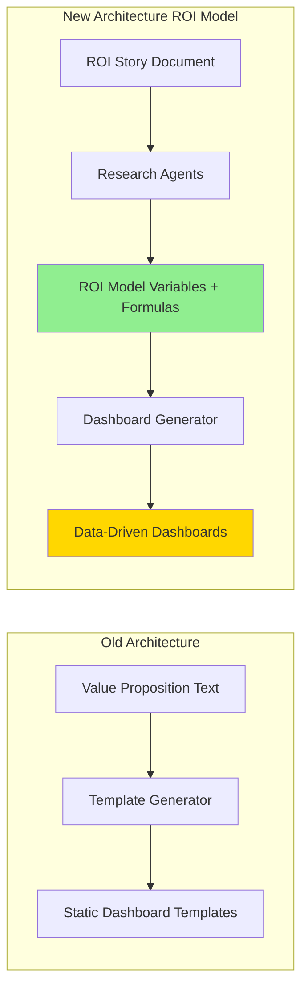

| Concept | Old System | New System (ROI Model) |
|---------|-----------|------------------------|
| **Primary Entity** | Value Proposition (qualitative) | **ROI Model** (quantitative) |
| **Input** | Client documents/research | **ROI Story** (structured document) |
| **Classification** | None | **13 ROI Model Types** |
| **Variables** | Hardcoded | **Dynamic variables** extracted |
| **Formulas** | None | **Mathematical formulas** for calculations |
| **Output** | Static templates | **ROI Model → Dashboard Templates** |

### Key Features

✅ **Dual Research Modes**: Autonomous (15-25 searches) and Manual (5-15 searches)
✅ **Multi-Tool Integration**: Google search, web scraper, S3 document reader
✅ **ROI Model Extraction**: Extract variables, formulas, and assumptions for 13 ROI Model Types
✅ **Robust Validation**: 4-layer validation with retry feedback
✅ **Async Processing**: Background task execution with job tracking
✅ **Mock Mode**: Fallback to mock data when API keys unavailable

---

## 2. 13 ROI Model Types

### Overview

Research agents extract data to populate one of **13 distinct ROI Model Types**. Each type represents a different healthcare cost reduction or value creation strategy with specific:

- **Variables**: Baseline costs, targets, intervention parameters
- **Formulas**: ROI calculations, payback periods, savings projections
- **Data Requirements**: Claims types, member data, clinical outcomes
- **Industry Benchmarks**: Typical ranges for metrics

### Type Classification Matrix

| # | ROI Model Type | Category | Key Metrics | Typical ROI Range |
|---|----------------|----------|-------------|-------------------|
| **1** | **Unit Price Reduction** | Cost Reduction | Unit cost PMPM, contract savings % | 150-300% |
| **2** | **Site of Care Shift** | Utilization | HOPD vs freestanding cost delta | 200-400% |
| **3** | **Provider Steering** | Cost Reduction | Tier differential, steering rate | 180-350% |
| **4** | **Payment Integrity** | Administrative | Overpayment recovery $, edit hit rate | 500-1000% |
| **5** | **Utilization Reduction** | Utilization | Low-value service rate, reduction % | 200-450% |
| **6** | **Medical Management** | Utilization | Chronic disease costs, outcomes | 250-500% |
| **7** | **Episode Optimization** | Utilization | Episode cost, pathway adherence % | 150-300% |
| **8** | **OON Mitigation** | Administrative | OON rate, cost differential | 300-600% |
| **9** | **Leakage Recapture** | Utilization | Leakage %, in-system advantage | 200-400% |
| **10** | **Pharmacy Optimization** | Cost Reduction | Pharmacy PMPM, specialty drug % | 250-400% |
| **11** | **Supply Chain Validation** | Administrative | Device/implant cost variance | 400-800% |
| **12** | **Admin Error Reduction** | Administrative | Duplicate payment $, errors | 600-1200% |
| **13** | **Vendor Incentive ROI** | Utilization | Incentive $, steerage impact | 100-250% |

### Research Agent Role

**WebSearchAgent** and **DocumentAnalysisAgent** extract:

1. **ROI Model Type Indicators**: Keywords, themes, and metrics suggesting which of 13 types applies
2. **Variable Values**: Baseline costs, population sizes, target metrics, intervention parameters
3. **Formula Components**: Cost calculations, savings formulas, ROI methodology
4. **Assumptions**: Industry benchmarks, default values, data source requirements
5. **Evidence**: Supporting sources, confidence scores, extracted page numbers

The extracted data feeds into the **ROI Model Builder Agent** (separate system) which constructs the complete ROI Model.

---

## 3. System Architecture

### 3.1 High-Level Architecture

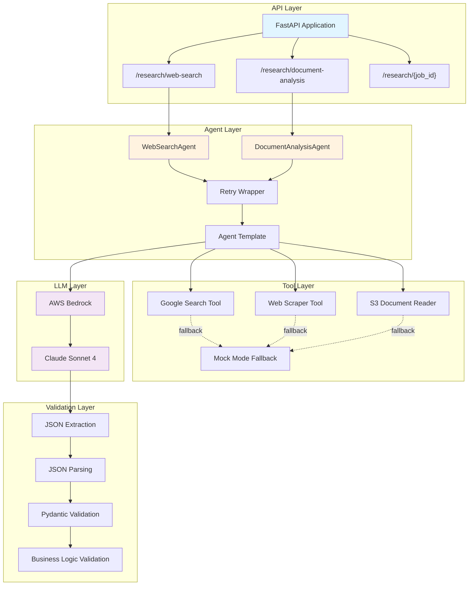

### 3.2 Data Flow Overview (ROI Model Extraction)

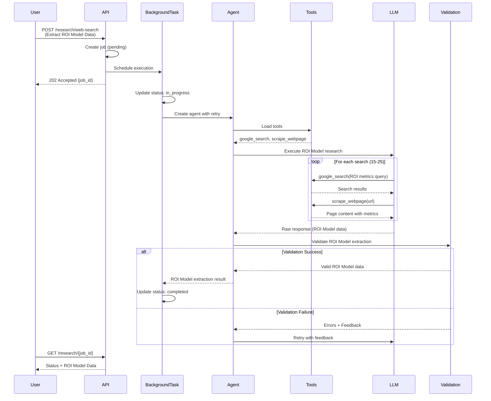

---

## 4. WebSearchAgent

### Purpose: ROI Model Data Extraction via Web Search

The WebSearchAgent researches healthcare companies to extract **ROI Model data components**:

- **ROI Model Type Indicators**: Keywords and themes suggesting which of 13 ROI Model Types applies
- **Quantitative Metrics**: Baseline costs, savings percentages, population sizes, PMPM values
- **Formula Components**: ROI calculation methods, payback period formulas, savings calculations
- **Clinical Outcomes**: HbA1c reductions, admission rate decreases, adherence improvements
- **Financial Evidence**: Contract savings, cost avoidance, total cost of care reductions
- **Target Audiences**: Health plans, employers, providers, TPAs
- **Industry Benchmarks**: Typical ranges for metrics in each ROI Model Type

### 4.1 Agent Creation Flow

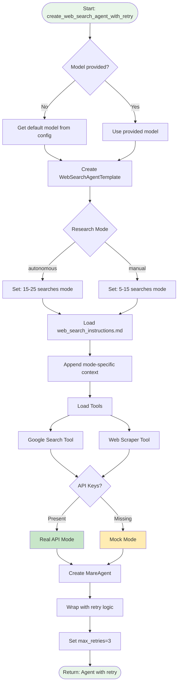

### 4.2 Execution Flow (Autonomous Mode) - ROI Model Data Extraction

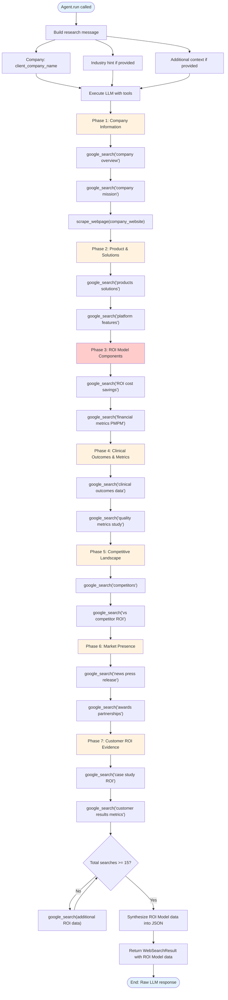

### 4.3 Execution Flow (Manual Mode) - ROI Model Data Extraction

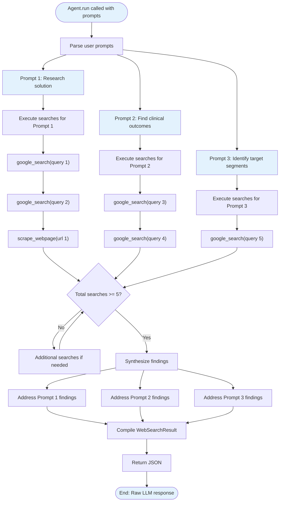

### 4.4 Tool Integration Flow

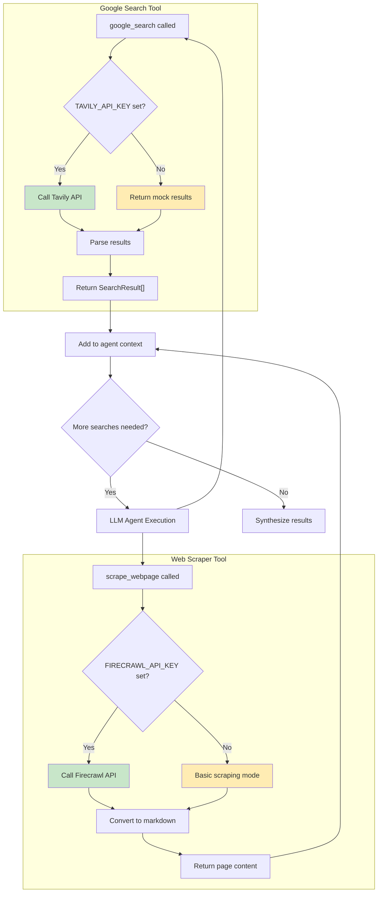

### 4.5 Retry Logic with Validation Feedback

```mermaid
flowchart TD
    START([run_with_retry called]) --> ATTEMPT_1["Attempt 1/3"]

    ATTEMPT_1 --> EXEC_1[Execute agent.run]
    EXEC_1 --> EXTRACT_1[Extract JSON from response]

    EXTRACT_1 --> JSON_OK_1{JSON extracted?}
    JSON_OK_1 -->|No| ERROR_1[Build error feedback]
    JSON_OK_1 -->|Yes| PARSE_1[Parse JSON]

    PARSE_1 --> PARSE_OK_1{Valid JSON syntax?}
    PARSE_OK_1 -->|No| ERROR_1
    PARSE_OK_1 -->|Yes| PYDANTIC_1[Pydantic validation]

    PYDANTIC_1 --> PYD_OK_1{Pydantic valid?}
    PYD_OK_1 -->|No| ERROR_1
    PYD_OK_1 -->|Yes| BUSINESS_1[Business logic validation]

    BUSINESS_1 --> BUS_OK_1{Business rules pass?}
    BUS_OK_1 -->|Yes| SUCCESS([Return validated result])
    BUS_OK_1 -->|No| ERROR_1

    ERROR_1 --> ATTEMPT_2["Attempt 2/3"]
    ATTEMPT_2 --> FEEDBACK_2["Append feedback to message:<br/>- Previous errors<br/>- Validation failures<br/>- Correction guidance"]

    FEEDBACK_2 --> EXEC_2[Execute agent.run with feedback]
    EXEC_2 --> EXTRACT_2[Extract JSON]

    EXTRACT_2 --> JSON_OK_2{JSON extracted?}
    JSON_OK_2 -->|No| ERROR_2[Build error feedback]
    JSON_OK_2 -->|Yes| PARSE_2[Parse JSON]

    PARSE_2 --> PARSE_OK_2{Valid JSON syntax?}
    PARSE_OK_2 -->|No| ERROR_2
    PARSE_OK_2 -->|Yes| PYDANTIC_2[Pydantic validation]

    PYDANTIC_2 --> PYD_OK_2{Pydantic valid?}
    PYD_OK_2 -->|No| ERROR_2
    PYD_OK_2 -->|Yes| BUSINESS_2[Business logic validation]

    BUSINESS_2 --> BUS_OK_2{Business rules pass?}
    BUS_OK_2 -->|Yes| SUCCESS
    BUS_OK_2 -->|No| ERROR_2

    ERROR_2 --> ATTEMPT_3["Attempt 3/3"]
    ATTEMPT_3 --> FEEDBACK_3["Append cumulative feedback:<br/>- All previous errors<br/>- Specific field failures<br/>- Strict JSON format reminder"]

    FEEDBACK_3 --> EXEC_3[Execute agent.run with full feedback]
    EXEC_3 --> EXTRACT_3[Extract JSON]

    EXTRACT_3 --> JSON_OK_3{JSON extracted?}
    JSON_OK_3 -->|No| FAILURE[Raise RuntimeError]
    JSON_OK_3 -->|Yes| PARSE_3[Parse JSON]

    PARSE_3 --> PARSE_OK_3{Valid JSON syntax?}
    PARSE_OK_3 -->|No| FAILURE
    PARSE_OK_3 -->|Yes| PYDANTIC_3[Pydantic validation]

    PYDANTIC_3 --> PYD_OK_3{Pydantic valid?}
    PYD_OK_3 -->|No| FAILURE
    PYD_OK_3 -->|Yes| BUSINESS_3[Business logic validation]

    BUSINESS_3 --> BUS_OK_3{Business rules pass?}
    BUS_OK_3 -->|Yes| SUCCESS
    BUS_OK_3 -->|No| FAILURE

    style START fill:#e8f5e9
    style SUCCESS fill:#c8e6c9
    style FAILURE fill:#ffcdd2
    style FEEDBACK_2 fill:#fff9c4
    style FEEDBACK_3 fill:#ffecb3
```

---

## 5. DocumentAnalysisAgent

### Purpose: ROI Model Data Extraction from ROI Story Documents

The DocumentAnalysisAgent analyzes **ROI Story documents** (client-uploaded PDFs, DOCX, TXT) to extract **ROI Model data components**:

- **ROI Model Type Indicators**: Document themes suggesting which of 13 ROI Model Types applies
- **Quantitative Metrics**: Baseline costs, target savings, population sizes, financial projections
- **Formula Components**: ROI calculations, cost methodologies referenced in documents
- **Clinical Metrics**: Patient outcomes, quality measures, utilization rates
- **Financial Data**: Intervention costs, implementation timelines, payback periods
- **Assumptions**: Stated assumptions, industry benchmarks mentioned
- **Data Requirements**: Identified data sources needed for calculations

### 5.1 Agent Creation Flow

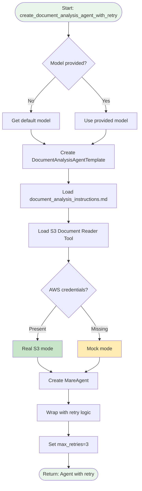

### 5.2 Document Analysis Execution Flow (ROI Story Data Extraction)

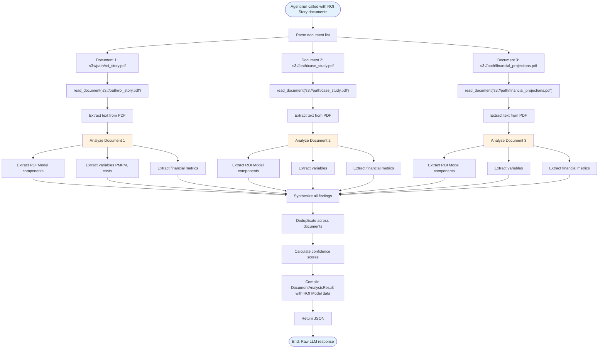

### 4.3 Document Type Processing

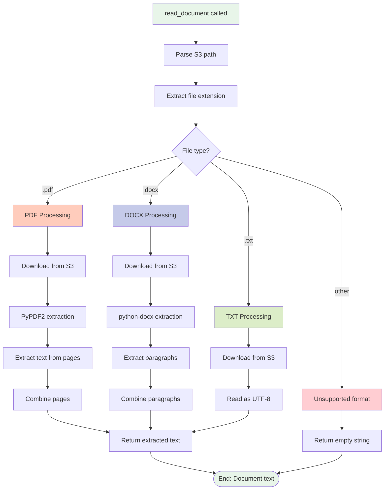

### 4.4 Tool Integration (S3 Document Reader)

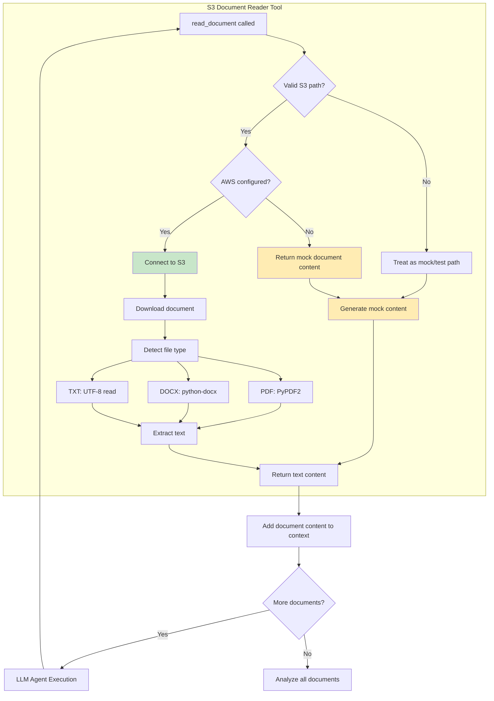

### 4.5 Retry Logic (Same as WebSearchAgent)

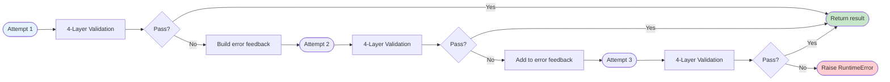

---

## 5. API Layer

### 5.1 API Request Flow (Sequence Diagram)

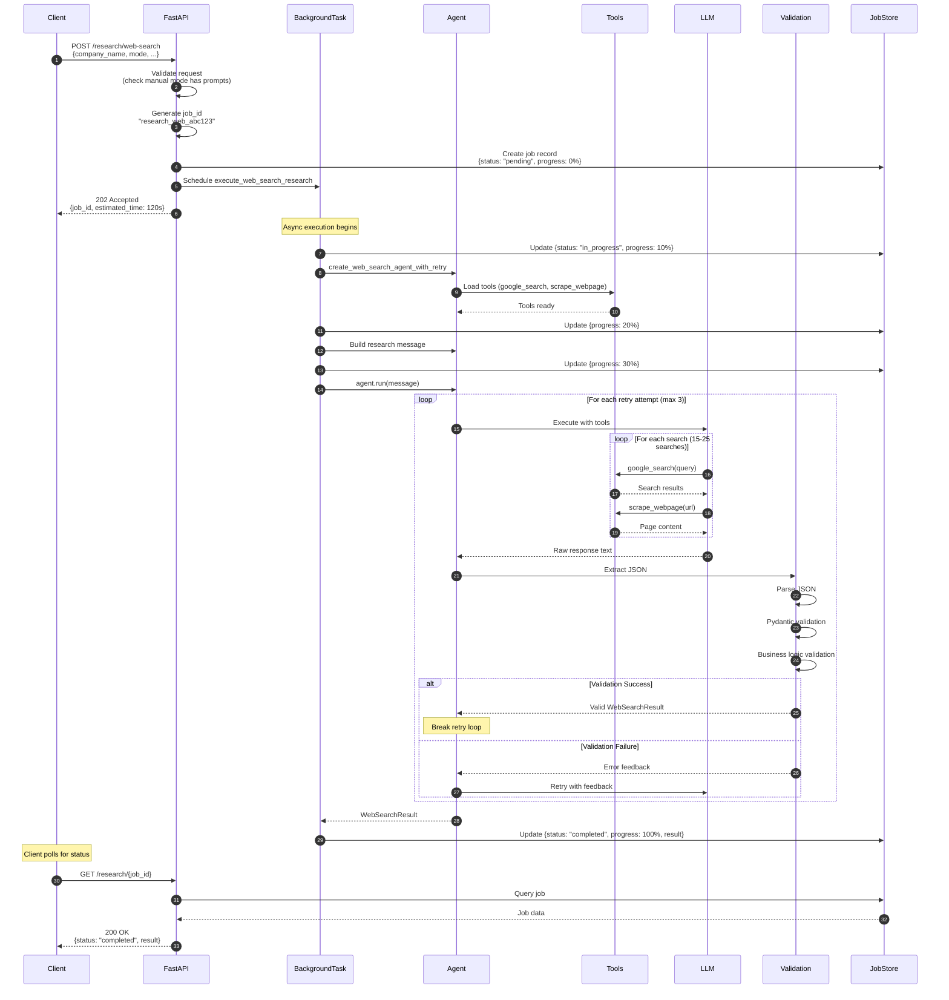

### 5.2 Job State Machine

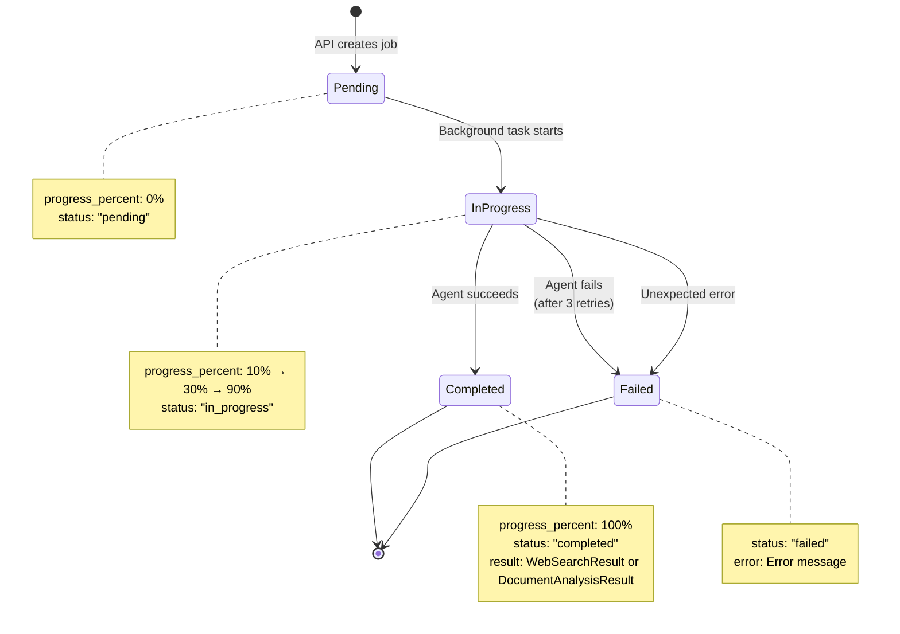

### 5.3 Background Task Progression

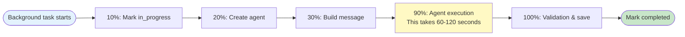

### 5.4 API Endpoints

| Method | Endpoint | Description | Response |
|--------|----------|-------------|----------|
| **POST** | `/research/web-search` | Initiate web search research | 202 Accepted + job_id |
| **POST** | `/research/document-analysis` | Initiate document analysis | 202 Accepted + job_id |
| **GET** | `/research/{job_id}` | Get job status and results | 200 OK + job data |
| **GET** | `/research/` | List jobs with filters | 200 OK + paginated list |
| **GET** | `/research/stats/summary` | Get aggregate statistics | 200 OK + stats |
| **POST** | `/research/validate` | Validate research result | 200 OK + validation report |

---

## 6. Validation Pipeline

### 6.1 Four-Layer Validation Process

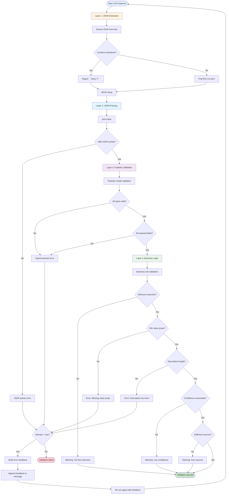

### 6.2 Validation Rules

#### WebSearchResult Validation

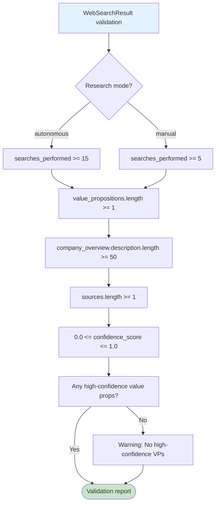

#### DocumentAnalysisResult Validation

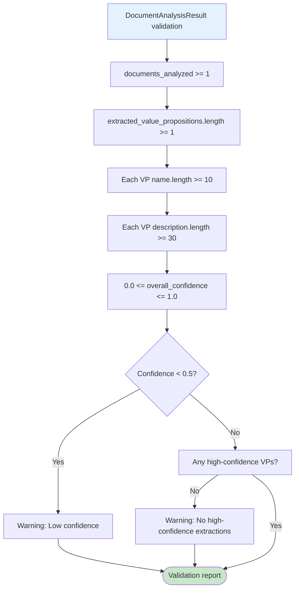

---

## 7. Data Models

### 7.1 WebSearchResult Model Hierarchy

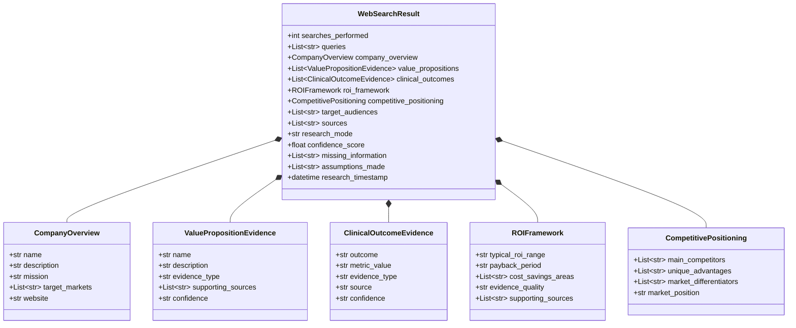

### 7.2 DocumentAnalysisResult Model Hierarchy

```mermaid
classDiagram
    class DocumentAnalysisResult {
        +int documents_analyzed
        +List~str~ document_names
        +List~ExtractedValueProposition~ extracted_value_propositions
        +List~ExtractedClinicalOutcome~ clinical_outcomes
        +List~ExtractedFinancialMetric~ financial_metrics
        +List~str~ target_audiences
        +List~ExtractedCompetitiveAdvantage~ competitive_advantages
        +str additional_context
        +float overall_confidence
        +List~str~ missing_information
        +datetime analysis_timestamp
    }

    class ExtractedValueProposition {
        +str name
        +str description
        +Dict metrics
        +str source_document
        +List~int~ page_numbers
        +str confidence
    }

    class ExtractedClinicalOutcome {
        +str outcome
        +str metric_value
        +str source_document
        +List~int~ page_numbers
        +str confidence
    }

    class ExtractedFinancialMetric {
        +str metric_name
        +str value
        +str context
        +str source_document
        +List~int~ page_numbers
    }

    class ExtractedCompetitiveAdvantage {
        +str advantage
        +str supporting_evidence
        +str source_document
    }

    DocumentAnalysisResult *-- ExtractedValueProposition
    DocumentAnalysisResult *-- ExtractedClinicalOutcome
    DocumentAnalysisResult *-- ExtractedFinancialMetric
    DocumentAnalysisResult *-- ExtractedCompetitiveAdvantage
```

### 7.3 API Request/Response Models

```mermaid
classDiagram
    class WebSearchRequest {
        +str client_company_name
        +str research_mode
        +str industry_hint
        +List~str~ prompts
        +str additional_context
        +int max_searches
    }

    class DocumentAnalysisRequest {
        +List~str~ document_ids
        +str additional_context
    }

    class ResearchJobResponse {
        +str job_id
        +str status
        +str message
        +str research_type
        +datetime created_at
        +int estimated_completion_seconds
    }

    class ResearchJobStatusResponse {
        +str job_id
        +str status
        +str research_type
        +int progress_percent
        +datetime created_at
        +datetime started_at
        +datetime completed_at
        +dict result
        +str error
    }

    class ResearchJobListResponse {
        +int total
        +int page
        +int page_size
        +List~ResearchJobStatusResponse~ jobs
    }

    class ResearchStatsResponse {
        +int total_jobs
        +int web_search_jobs
        +int document_analysis_jobs
        +int completed_jobs
        +int failed_jobs
        +float average_duration_seconds
        +float success_rate
    }

    ResearchJobListResponse *-- ResearchJobStatusResponse
```

---

## 8. Component Specifications

### 8.1 WebSearchAgent

**File:** `agents/web_search_agent.py`

**Key Functions:**

- `create_web_search_agent()` - Creates base agent
- `create_web_search_agent_with_retry()` - Wraps with retry logic
- `extract_json_from_response()` - Extracts JSON from LLM output

**Configuration:**

```python
research_mode: "autonomous" | "manual"
max_retries: int = 3
model: AWS Bedrock Claude Sonnet 4
tools: [GoogleSearchTool, WebScraperTool]
```

**Research Modes:**

- **Autonomous**: 15-25 searches across 7 research areas
- **Manual**: 5-15 searches following user prompts

**Instructions:** `agents/templates/web_search_instructions.md` (376 lines)

### 8.2 DocumentAnalysisAgent

**File:** `agents/document_analysis_agent.py`

**Key Functions:**

- `create_document_analysis_agent()` - Creates base agent
- `create_document_analysis_agent_with_retry()` - Wraps with retry logic
- `extract_json_from_response()` - Extracts JSON from LLM output

**Configuration:**

```python
max_retries: int = 3
model: AWS Bedrock Claude Sonnet 4
tools: [S3DocumentReaderTool]
```

**Supported Document Types:**

- **PDF**: PyPDF2 extraction
- **DOCX**: python-docx extraction
- **TXT**: UTF-8 text reading

**Instructions:** `agents/templates/document_analysis_instructions.md` (345 lines)

### 8.3 Tool Specifications

#### Google Search Tool

**File:** `tools/google_search_tool.py`

**API:** Tavily Search API (AI-optimized search)

**Mock Mode:** Returns 3 mock search results when `TAVILY_API_KEY` not set

**Function Signature:**

```python
def google_search(
    query: str,
    max_results: int = 5,
    include_raw_content: bool = False
) -> List[Dict[str, Any]]
```

**Returns:**

```python
[{
    "title": str,
    "url": str,
    "snippet": str,
    "content": str,  # if include_raw_content=True
    "score": float
}]
```

#### Web Scraper Tool

**File:** `tools/web_scraper_tool.py`

**API:** Firecrawl API (structured web scraping)

**Mock Mode:** Returns placeholder content when `FIRECRAWL_API_KEY` not set

**Function Signature:**

```python
def scrape_webpage(url: str) -> str
```

**Returns:** Markdown-formatted page content

#### S3 Document Reader Tool

**File:** `tools/s3_document_reader.py`

**Dependencies:** boto3, PyPDF2, python-docx

**Mock Mode:** Returns mock document content when AWS not configured

**Function Signature:**

```python
def read_document(storage_path: str) -> str
```

**Path Format:** `s3://bucket/key` or `bucket/key`

**Returns:** Extracted text from document

---

## 9. Configuration & Setup

### 9.1 Environment Variables

```bash
# Model Configuration
DEFAULT_MODEL_PROVIDER=aws_bedrock
DEFAULT_MODEL_NAME=us.anthropic.claude-sonnet-4-20250514-v1:0

# AWS Bedrock (Required)
AWS_PROFILE=your-profile
AWS_REGION=us-east-1

# Research Tool APIs (Optional - uses mock mode if not set)
TAVILY_API_KEY=tvly-...          # For Google search
FIRECRAWL_API_KEY=fc-...         # For web scraping

# API Server
API_HOST=0.0.0.0
API_PORT=8000

# Logging
LOG_LEVEL=INFO
DEBUG_MODE=false
```

### 9.2 Installation

```bash
# Create virtual environment
python3 -m venv venv
source venv/bin/activate  # Windows: venv\Scripts\activate

# Install dependencies
pip install -r requirements.txt

# Configure environment
cp .env.example .env
# Edit .env with your credentials
```

### 9.3 Running the System

**Start API Server:**

```bash
uvicorn app:app --reload --port 8000
```

**Access Documentation:**

- Swagger UI: http://localhost:8000/docs
- ReDoc: http://localhost:8000/redoc

**Run Tests:**

```bash
python tests/test_research_api.py
```

---

## 10. Example Usage

### 10.1 Web Search Research (Autonomous Mode)

**Request:**

```bash
curl -X POST "http://localhost:8000/research/web-search" \
  -H "Content-Type: application/json" \
  -d '{
    "client_company_name": "Livongo Health",
    "research_mode": "autonomous",
    "industry_hint": "diabetes management",
    "additional_context": "Focus on ROI and clinical outcomes"
  }'
```

**Response (202 Accepted):**

```json
{
  "job_id": "research_web_abc123",
  "status": "pending",
  "message": "Web search research initiated for Livongo Health",
  "research_type": "web_search",
  "created_at": "2025-12-08T10:30:00Z",
  "estimated_completion_seconds": 120
}
```

**Check Status:**

```bash
curl "http://localhost:8000/research/research_web_abc123"
```

**Response (Completed):**

```json
{
  "job_id": "research_web_abc123",
  "status": "completed",
  "research_type": "web_search",
  "progress_percent": 100,
  "result": {
    "searches_performed": 18,
    "queries": ["Livongo diabetes", "Livongo ROI", ...],
    "company_overview": {
      "name": "Livongo Health",
      "description": "Digital health company focused on...",
      "mission": "Empower people with chronic conditions",
      "target_markets": ["Health Plans", "Employers"],
      "website": "https://livongo.com"
    },
    "value_propositions": [{
      "name": "Cost Reduction through Prevention",
      "description": "Reduce diabetes-related costs...",
      "evidence_type": "explicit",
      "supporting_sources": ["https://livongo.com/roi"],
      "confidence": "high"
    }],
    "confidence_score": 0.85
  }
}
```

### 10.2 Document Analysis

**Request:**

```bash
curl -X POST "http://localhost:8000/research/document-analysis" \
  -H "Content-Type: application/json" \
  -d '{
    "document_ids": [
      "s3://triton-docs/client123/roi_sheet.pdf",
      "s3://triton-docs/client123/case_study.pdf"
    ],
    "additional_context": "Diabetes management for health plans"
  }'
```

**Response (202 Accepted):**

```json
{
  "job_id": "research_doc_xyz789",
  "status": "pending",
  "message": "Document analysis initiated for 2 documents",
  "research_type": "document_analysis",
  "estimated_completion_seconds": 60
}
```

**Result:**

```json
{
  "documents_analyzed": 2,
  "document_names": ["roi_sheet.pdf", "case_study.pdf"],
  "extracted_value_propositions": [{
    "name": "340% ROI in 24 Months",
    "description": "Achieve 340% return on investment...",
    "metrics": {"roi": "340%", "payback_months": 14},
    "source_document": "roi_sheet.pdf",
    "page_numbers": [1, 2],
    "confidence": "high"
  }],
  "financial_metrics": [{
    "metric_name": "24-Month ROI",
    "value": "340%",
    "context": "Based on 1000-member population",
    "source_document": "roi_sheet.pdf",
    "page_numbers": [1]
  }],
  "overall_confidence": 0.95
}
```

### 10.3 Python Client Example

```python
import requests
import time

BASE_URL = "http://localhost:8000"

# Initiate research
response = requests.post(f"{BASE_URL}/research/web-search", json={
    "client_company_name": "Livongo Health",
    "research_mode": "autonomous",
    "industry_hint": "diabetes management"
})

job_id = response.json()["job_id"]
print(f"Research job created: {job_id}")

# Poll for completion
while True:
    status_response = requests.get(f"{BASE_URL}/research/{job_id}")
    status = status_response.json()

    print(f"Status: {status['status']} ({status.get('progress_percent', 0)}%)")

    if status["status"] == "completed":
        result = status["result"]
        print(f"\n✓ Research complete!")
        print(f"  - Searches: {result['searches_performed']}")
        print(f"  - Company: {result['company_overview']['name']}")
        print(f"  - Value props: {len(result['value_propositions'])}")
        print(f"  - Confidence: {result['confidence_score']}")
        break
    elif status["status"] == "failed":
        print(f"\n✗ Research failed: {status['error']}")
        break

    time.sleep(2)
```

---

## Summary

This research agent system provides:

✅ **Comprehensive Web Research**: 15-25 searches across 7 key research areas
✅ **Document Intelligence**: Extract value propositions from client materials
✅ **Robust Validation**: 4-layer validation with automatic retry
✅ **Production-Ready API**: Async processing with job tracking
✅ **Mock Mode Support**: Test without external API dependencies
✅ **Rich Data Models**: Structured output with confidence scores

**Total Implementation:**

- 3,073 lines of production code
- 2 specialized agents
- 3 tool integrations
- 6 REST API endpoints
- 4-layer validation pipeline
- 15+ Mermaid diagrams (in this document)

---

**Document Version:** 1.0.0
**Last Updated:** 2025-12-08
**Status:** Complete ✅
