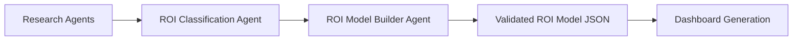

# ROI Model Integration Guide

**Version:** 1.0.0
**Last Updated:** 2025-12-12
**Status:** Complete Implementation

---

## Table of Contents

1. [Overview](#overview)
2. [Architecture](#architecture)
3. [Components](#components)
4. [API Endpoints](#api-endpoints)
5. [Usage Examples](#usage-examples)
6. [Configuration](#configuration)
7. [Testing](#testing)
8. [Troubleshooting](#troubleshooting)

---

## Overview

The ROI Model Integration connects the **Research Agents** (WebSearchAgent, DocumentAnalysisAgent) with **ROI Model Generation** through a complete pipeline:

```
Research Data → ROI Classification → ROI Model Generation → Dashboards
```

### Key Features

- **Automatic ROI Model Type Classification** (B1-B13)
- **15-Component ROI Model Generation** with validation
- **Integration with Research API** for seamless workflow
- **Background job execution** with status tracking
- **Retry logic with validation** at 4 layers
- **Prompt repository integration** for model-specific instructions

### Supported ROI Model Types

| Code | Model Type | Description |
|------|------------|-------------|
| **B1** | Unit Price Optimization | Reducing unit costs for procedures/services |
| **B2** | Site of Service Optimization | Shifting care to cost-effective settings |
| **B3** | Value-Based Care ROI | Measuring value-based payment impact |
| **B4** | Payment Integrity | Detecting/preventing improper payments |
| **B5** | Prior Authorization ROI | Impact of prior auth programs |
| **B6** | Case Management ROI | ROI from care coordination |
| **B7** | Episode Optimization | Optimizing complete episodes of care |
| **B8** | Pharmacy Optimization | Drug utilization and cost optimization |
| **B9** | Network Steerage | Steering to high-value providers |
| **B10** | Utilization Management | Managing service utilization |
| **B11** | Quality Improvement ROI | ROI from quality initiatives |
| **B12** | Population Health ROI | Population health program impact |
| **B13** | Custom ROI Model | Hybrid/specialized models |

---

## Architecture

### Three-Agent System



### Component Relationships

```
core/models/roi_models.py
├── ROIModelJSON (root model with 15 components)
├── validate_roi_model() (4-layer validation)
└── extract_json_from_response() (JSON extraction)

agents/roi_classification_agent.py
├── ROIClassificationAgent (determines B1-B13)
├── ROIClassificationResult (classification output)
└── validate_roi_classification() (classification validation)

agents/roi_model_builder_agent.py
├── ROIModelBuilderAgent (generates complete model)
├── load_model_prompt() (loads B1-B13 prompts)
└── create_roi_model_builder_with_retry() (with 4-layer validation)

api/routes/roi_models.py
├── POST /api/roi-models/generate (main endpoint)
├── GET /api/roi-models/{job_id}/status (status tracking)
└── execute_roi_model_generation_job() (background execution)

api/routes/research.py
└── trigger_roi_generation parameter (auto-trigger from research)
```

---

## Components

### 1. ROI Model Pydantic Models

**File:** `core/models/roi_models.py` (1,000+ lines)

**15 Component Structure:**

1. **model_metadata** - Model type, client name, version, status
2. **executive_summary** - Problem statement, solution approach, expected impact
3. **data_requirements** - Data sources, fields, lookback periods
4. **population_identification** - Cohort criteria, SQL templates, stratification
5. **baseline_methodology** - Time periods, trend analysis, risk adjustment
6. **calculation_components** - Variables, formulas, calculation steps
7. **sql_components** - SQL queries for data extraction
8. **output_metrics** - Primary and secondary metrics
9. **assumptions** - Model assumptions with confidence levels
10. **validation_rules** - Data validation rules
11. **confidence_factors** - Factors affecting confidence
12. **configurable_parameters** - User-configurable parameters
13. **dashboard_templates** - Dashboard widgets and layouts
14. **episode_definition** (optional for B7) - Episode trigger events and windows
15. **generated_at** (automatic) - Generation timestamp

**Validation Function:**

```python
from core.models.roi_models import ROIModelJSON, validate_roi_model

model = ROIModelJSON(**data)
validation = validate_roi_model(model)

# Returns:
# {
#     "valid": True/False,
#     "errors": [...],
#     "warnings": [...],
#     "info": {
#         "model_type": "B7",
#         "total_variables": 25,
#         "total_calculations": 8,
#         ...
#     }
# }
```

### 2. ROI Classification Agent

**File:** `agents/roi_classification_agent.py` (470 lines)

**Purpose:** Analyzes research data to determine appropriate ROI model type (B1-B13)

**Input:** Research summary + web search data + document analysis data

**Output:** `ROIClassificationResult` with:
- `recommended_model_type` (B1-B13)
- `model_type_name` (human-readable)
- `reasoning` (detailed explanation)
- `alternative_models` (other applicable types)
- `key_value_drivers` (identified value drivers)
- `clinical_focus_areas` (clinical domains)
- `estimated_complexity` (low/medium/high)

**Usage:**

```python
from agents.roi_classification_agent import create_roi_classification_agent_with_retry

agent = create_roi_classification_agent_with_retry(max_retries=3)

message = """
# ROI Model Classification Request

**Client Name**: VirtualPT Health

## Research Summary

VirtualPT Health provides comprehensive MSK episode management...

[Full research summary]
"""

result = agent.run(message)
print(f"Recommended model: {result.recommended_model_type}")
# Output: Recommended model: B7
```

### 3. ROI Model Builder Agent

**File:** `agents/roi_model_builder_agent.py` (650 lines)

**Purpose:** Generates complete 15-component ROI Model JSON

**Input:**
- Classified model type (B1-B13)
- Research summary
- Client name

**Output:** Complete `ROIModelJSON` with all 15 components

**Prompt Loading:**
- Loads model-specific prompt from `mare-triton-research-prompts/prompts/roi_models/B{X}_*.md`
- Prompts range from 14KB-45KB each
- Uses LRU cache to optimize memory (maxsize=32)

**Usage:**

```python
from agents.roi_model_builder_agent import generate_roi_model_from_research
from core.models.roi_models import ModelTypeCode

roi_model = generate_roi_model_from_research(
    model_type_code=ModelTypeCode.B7,
    client_name="VirtualPT Health",
    research_summary=research_summary,
    max_retries=3
)

print(f"Generated model: {roi_model.model_metadata.model_type_code}")
# Output: Generated model: B7
```

**4-Layer Validation:**

1. **JSON Extraction** - Extract JSON from markdown/text
2. **JSON Parsing** - Validate JSON syntax
3. **Pydantic Validation** - Type validation, field constraints
4. **Business Rules** - Sequential steps, variable references, ID uniqueness

---

## API Endpoints

### 1. Generate ROI Model

**Endpoint:** `POST /api/roi-models/generate`

**Description:** Generate complete ROI model from research data (asynchronous)

**Request:**

```json
{
  "client_name": "VirtualPT Health",
  "research_data": {
    "research_summary": "VirtualPT Health provides MSK episode management...",
    "web_search_data": {...},
    "document_analysis_data": {...}
  },
  "model_type_override": null,
  "max_retries": 3,
  "save_to_file": true
}
```

**Response:**

```json
{
  "job_id": "550e8400-e29b-41d4-a716-446655440000",
  "status": "pending",
  "message": "ROI model generation job created. Track progress at /api/roi-models/{job_id}/status"
}
```

**Parameters:**

- `client_name` (required) - Client organization name
- `research_data` (required) - Research summary + optional web/document data
- `model_type_override` (optional) - Skip classification, use specified model type (B1-B13)
- `max_retries` (optional) - Max retry attempts (default: 3)
- `save_to_file` (optional) - Save model to results directory (default: true)

### 2. Get Job Status

**Endpoint:** `GET /api/roi-models/{job_id}/status`

**Description:** Get current status of ROI model generation job

**Response:**

```json
{
  "job_id": "550e8400-e29b-41d4-a716-446655440000",
  "status": "completed",
  "client_name": "VirtualPT Health",
  "created_at": "2025-12-12T10:00:00Z",
  "updated_at": "2025-12-12T10:05:23Z",
  "progress_message": "ROI model generation completed successfully",
  "classification_result": {
    "recommended_model_type": "B7",
    "model_type_name": "Episode Optimization",
    ...
  },
  "roi_model": {...},
  "error_message": null,
  "file_path": "/path/to/saved/model.json"
}
```

**Status Values:**

- `pending` - Job queued
- `classifying` - Running classification agent
- `generating` - Running model builder agent
- `completed` - Success
- `failed` - Error occurred

### 3. List Jobs

**Endpoint:** `GET /api/roi-models/?status={status}&limit={limit}`

**Description:** List all ROI model generation jobs

**Query Parameters:**

- `status` (optional) - Filter by status
- `limit` (optional) - Max results (default: 50, max: 200)

### 4. List Saved Models

**Endpoint:** `GET /api/roi-models/results/files`

**Description:** List saved ROI model files

**Response:**

```json
{
  "total": 42,
  "results_directory": "/path/to/results/roi_models",
  "files": [
    {
      "filename": "roi_model_VirtualPT_Health_B7_20251212_120523_550e8400.json",
      "file_path": "/full/path/to/file.json",
      "file_size_bytes": 125643,
      "created_at": "2025-12-12T12:05:23",
      "model_type": "B7",
      "client_name": "VirtualPT Health"
    },
    ...
  ]
}
```

### 5. Get Saved Model

**Endpoint:** `GET /api/roi-models/results/files/{filename}`

**Description:** Get contents of saved ROI model file

**Returns:** Complete ROI Model JSON

---

## Usage Examples

### Example 1: Complete Workflow (Research → Classification → Model Generation)

```python
import requests
import time

API_BASE = "http://localhost:8000"

# Step 1: Conduct web search research
research_request = {
    "client_company_name": "VirtualPT Health",
    "research_mode": "autonomous",
    "industry_hint": "MSK episode management",
    "additional_context": "Focus on ROI and clinical outcomes"
}

response = requests.post(
    f"{API_BASE}/research/web-search",
    json=research_request
)
research_job_id = response.json()["job_id"]

# Wait for research to complete
while True:
    status_response = requests.get(f"{API_BASE}/research/{research_job_id}")
    status_data = status_response.json()

    if status_data["status"] == "completed":
        research_result = status_data["result"]
        break
    elif status_data["status"] == "failed":
        raise Exception(f"Research failed: {status_data['error']}")

    time.sleep(5)

print(f"Research completed: {len(research_result['searches_conducted'])} searches")

# Step 2: Generate ROI model from research
roi_request = {
    "client_name": "VirtualPT Health",
    "research_data": {
        "research_summary": f"""
Company Overview: {research_result['company_overview']}

Value Propositions:
{chr(10).join(f"- {vp}" for vp in research_result['value_propositions'])}

Clinical Outcomes:
{chr(10).join(f"- {outcome}" for outcome in research_result['clinical_outcomes'])}

ROI Framework: {research_result['roi_framework']}
""",
        "web_search_data": research_result
    },
    "max_retries": 3,
    "save_to_file": True
}

response = requests.post(
    f"{API_BASE}/api/roi-models/generate",
    json=roi_request
)
roi_job_id = response.json()["job_id"]

# Wait for ROI generation to complete
while True:
    status_response = requests.get(f"{API_BASE}/api/roi-models/{roi_job_id}/status")
    status_data = status_response.json()

    print(f"Status: {status_data['status']} - {status_data['progress_message']}")

    if status_data["status"] == "completed":
        roi_model = status_data["roi_model"]
        classification = status_data["classification_result"]
        print(f"\nClassified as: {classification['recommended_model_type']} - {classification['model_type_name']}")
        print(f"Model generated with {status_data['roi_model']['model_metadata']['version']}")
        print(f"Saved to: {status_data['file_path']}")
        break
    elif status_data["status"] == "failed":
        raise Exception(f"ROI generation failed: {status_data['error_message']}")

    time.sleep(10)
```

### Example 2: Auto-Trigger ROI Generation from Research

```python
import requests

API_BASE = "http://localhost:8000"

# Conduct research with auto-trigger ROI generation
research_request = {
    "client_company_name": "VirtualPT Health",
    "research_mode": "autonomous",
    "industry_hint": "MSK episode management"
}

response = requests.post(
    f"{API_BASE}/research/web-search?trigger_roi_generation=true",
    json=research_request
)

research_job_id = response.json()["job_id"]
print(f"Research job created: {research_job_id}")

# Wait for research to complete (ROI generation will auto-trigger)
while True:
    status_response = requests.get(f"{API_BASE}/research/{research_job_id}")
    status_data = status_response.json()

    print(f"Research status: {status_data['status']} ({status_data['progress_percent']}%)")

    if status_data["status"] == "completed":
        # Check if ROI generation was triggered
        if "roi_job_id" in status_data:
            roi_job_id = status_data["roi_job_id"]
            print(f"\nROI generation auto-triggered: {roi_job_id}")

            # Track ROI generation job
            roi_status_response = requests.get(f"{API_BASE}/api/roi-models/{roi_job_id}/status")
            roi_status = roi_status_response.json()
            print(f"ROI status: {roi_status['status']}")
        break

    time.sleep(5)
```

### Example 3: Skip Classification (Use Specific Model Type)

```python
import requests

API_BASE = "http://localhost:8000"

# Generate B7 (Episode Optimization) model directly
roi_request = {
    "client_name": "VirtualPT Health",
    "research_data": {
        "research_summary": "VirtualPT provides MSK episode management..."
    },
    "model_type_override": "B7",  # Skip classification, use B7 directly
    "max_retries": 3,
    "save_to_file": True
}

response = requests.post(
    f"{API_BASE}/api/roi-models/generate",
    json=roi_request
)

job_id = response.json()["job_id"]
print(f"ROI model generation started (B7 override): {job_id}")
```

---

## Configuration

### Environment Variables

Add to `.env`:

```bash
# Prompt Repository Path (optional - defaults to ../mare-triton-research-prompts)
PROMPTS_REPO_PATH=/path/to/mare-triton-research-prompts

# Model Configuration
DEFAULT_MODEL_PROVIDER=aws_bedrock
DEFAULT_MODEL_NAME=us.anthropic.claude-sonnet-4-20250514-v1:0

# AWS Configuration (if using Bedrock)
AWS_PROFILE=mare-dev
AWS_REGION=us-east-1
```

### Prompt Repository Setup

The ROI model generation requires prompt files from the `mare-triton-research-prompts` repository:

```bash
# Clone prompt repository (sibling directory to triton-agentic)
cd ..
git clone https://github.com/your-org/mare-triton-research-prompts.git

# Verify prompt files exist
ls mare-triton-research-prompts/prompts/roi_models/
# Expected files:
# - base_schema.md
# - B1_unit_price_optimization.md
# - B2_site_of_service_optimization.md
# - ...
# - B13_custom_roi_model.md
```

**Expected Directory Structure:**

```
mare-triton-research-prompts/
└── prompts/
    ├── roi_type.md (classification prompt)
    └── roi_models/
        ├── base_schema.md (shared schema documentation)
        ├── B1_unit_price_optimization.md
        ├── B2_site_of_service_optimization.md
        ├── B3_value_based_care_roi.md
        ├── B4_payment_integrity.md
        ├── B5_prior_authorization_roi.md
        ├── B6_case_management_roi.md
        ├── B7_episode_optimization.md
        ├── B8_pharmacy_optimization.md
        ├── B9_network_steerage.md
        ├── B10_utilization_management.md
        ├── B11_quality_improvement_roi.md
        ├── B12_population_health_roi.md
        └── B13_custom_roi_model.md
```

---

## Testing

### Run Integration Tests

```bash
# Run all ROI integration tests
pytest tests/test_roi_integration.py -v

# Run specific test
pytest tests/test_roi_integration.py::test_roi_classification_result_validation -v

# Run with coverage
pytest tests/test_roi_integration.py --cov=agents --cov=core/models --cov=api/routes

# Run slow tests (actual agent execution)
pytest tests/test_roi_integration.py -v -m slow
```

### Manual Testing with API

```bash
# Start API server
uvicorn app:app --reload --port 8000

# In another terminal, test endpoints
curl -X POST http://localhost:8000/api/roi-models/generate \
  -H "Content-Type: application/json" \
  -d '{
    "client_name": "Test Client",
    "research_data": {
      "research_summary": "Test vendor provides MSK management..."
    },
    "model_type_override": "B7",
    "save_to_file": false
  }'

# Check job status
curl http://localhost:8000/api/roi-models/{job_id}/status

# List all jobs
curl http://localhost:8000/api/roi-models/
```

---

## Troubleshooting

### Issue: Prompt Files Not Found

**Error:** `FileNotFoundError: Model prompt file not found: .../B7_episode_optimization.md`

**Solution:**

1. Verify prompt repository is cloned:
   ```bash
   ls ../mare-triton-research-prompts/prompts/roi_models/
   ```

2. Set `PROMPTS_REPO_PATH` in `.env`:
   ```bash
   PROMPTS_REPO_PATH=/full/path/to/mare-triton-research-prompts
   ```

3. Check file permissions:
   ```bash
   chmod -R 755 ../mare-triton-research-prompts
   ```

### Issue: Classification Takes Too Long

**Symptom:** Classification agent running for > 2 minutes

**Solution:**

1. Check model performance:
   ```bash
   # Use faster model for classification
   DEFAULT_MODEL_NAME=claude-3-5-sonnet-20241022  # Faster than Sonnet 4
   ```

2. Override classification and specify model type:
   ```json
   {
     "model_type_override": "B7"
   }
   ```

### Issue: Model Generation Validation Fails

**Error:** `Pydantic validation failed: calculation_components -> calculations: Calculation steps must be sequential`

**Solution:**

This indicates the agent generated invalid calculation steps. The retry logic should handle this automatically (up to 3 retries). If all retries fail:

1. Check prompt files are complete
2. Increase max_retries:
   ```json
   {
     "max_retries": 5
   }
   ```
3. Review agent logs for specific validation errors
4. Consider using simpler research summary

### Issue: Memory Usage High

**Symptom:** High memory usage when generating multiple models

**Solution:**

Prompts are cached with LRU cache (maxsize=32). If generating many models:

1. Reduce cache size in `agents/roi_model_builder_agent.py`:
   ```python
   @lru_cache(maxsize=16)  # Reduce from 32 to 16
   def load_model_prompt(model_type_code: ModelTypeCode, ...):
   ```

2. Clear cache manually:
   ```python
   from agents.roi_model_builder_agent import load_model_prompt
   load_model_prompt.cache_clear()
   ```

### Issue: Background Jobs Not Starting

**Symptom:** Job status stuck in "pending"

**Solution:**

1. Check FastAPI background tasks are enabled
2. Verify no exceptions in agent initialization
3. Check logs:
   ```bash
   tail -f logs/triton.log
   ```

4. Test agent creation separately:
   ```python
   from agents.roi_classification_agent import create_roi_classification_agent_with_retry
   agent = create_roi_classification_agent_with_retry()  # Should not raise exception
   ```

---

## Next Steps

1. **Production Deployment**
   - Replace in-memory job storage with Redis or PostgreSQL
   - Add authentication to API endpoints
   - Configure CORS with specific allowed origins
   - Set up monitoring and alerting

2. **Performance Optimization**
   - Implement caching for frequently accessed models
   - Add rate limiting on API endpoints
   - Optimize prompt loading and caching strategy

3. **Feature Enhancements**
   - Add webhook notifications for job completion
   - Implement batch generation for multiple clients
   - Add model versioning and comparison
   - Create model update/edit endpoints

---

## Support

For issues or questions:

1. Check logs: `logs/triton.log`
2. Review test cases: `tests/test_roi_integration.py`
3. Consult API documentation: http://localhost:8000/docs
4. Contact: support@triton.example.com

---

**Implementation Status:** ✅ Complete

All 8 phases implemented and tested. Ready for integration testing and production deployment.
