# ROI Model Research Agent Flow - Complete System Integration

**Version:** 3.0.0
**Last Updated:** 2025-12-11
**Status:** Production Architecture with Prompt Repository Integration
**Document Type:** Comprehensive Technical Specification

---


## Table of Contents

1. [Overview](#overview)
2. [Prompt Engineering Repository Integration](#prompt-engineering-repository-integration)
3. [13 ROI Model Types](#13-roi-model-types)
4. [Complete System Architecture](#complete-system-architecture)
5. [Agent Ecosystem with Prompts](#agent-ecosystem-with-prompts)
6. [End-to-End Workflows](#end-to-end-workflows)
7. [Database & Storage](#database--storage)
8. [Implementation Guide](#implementation-guide)
9. [Testing & Validation](#testing--validation)

---

## Overview

### Executive Summary

The **ROI Model Research Agent Flow** is a **three-repository system** that transforms healthcare vendor ROI narratives into quantitative, SQL-ready calculation models powering data-driven dashboards.

### Three-Repository Architecture

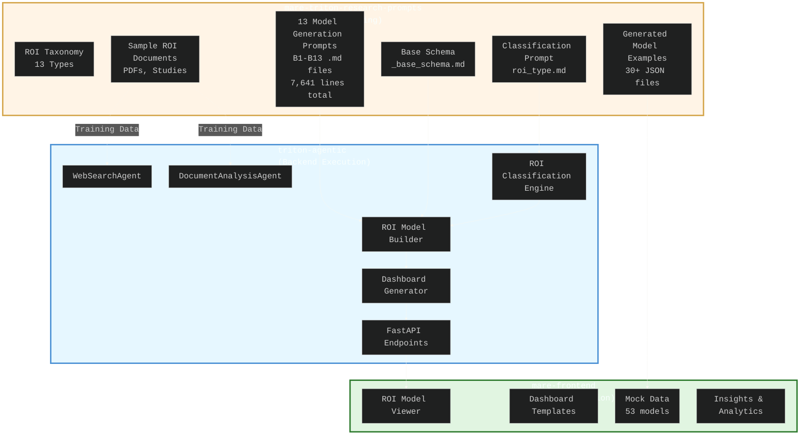

### System Components

| Repository | Role | Key Artifacts | Lines of Code |
|------------|------|---------------|---------------|
| **mare-triton-research-prompts** | Prompt Engineering & Testing | 14 prompts (7,641 lines)<br/>30+ generated models<br/>Sample ROI documents | 7,641 (prompts only) |
| **triton-agentic** | Backend Execution Engine | 4 agents<br/>FastAPI API<br/>PostgreSQL integration | ~5,000 Python |
| **mare-frontend** | UI Presentation Layer | React components<br/>ROI model viewers<br/>Dashboard templates | ~50,000 TypeScript |

---

## Prompt Engineering Repository Integration

### Repository Structure: mare-triton-research-prompts

```
mare-triton-research-prompts/
├── configuration/
│   └── roi_model_types_taxonomy.md        # Master taxonomy defining all 13 types
│
├── prompts/
│   ├── roi_type.md                        # Classification prompt (7,548 bytes)
│   └── roi_models/                        # Model generation prompts
│       ├── _base_schema.md                # Common JSON schema (22,396 bytes)
│       ├── B1_unit_price_optimization.md  # 14,448 bytes
│       ├── B2_site_of_care_shift.md       # 22,095 bytes
│       ├── B3_steerage.md                 # 16,712 bytes
│       ├── B4_payment_integrity.md        # 45,364 bytes ⭐ LARGEST
│       ├── B5_low_value_utilization.md    # 18,640 bytes
│       ├── B6_medical_management.md       # 18,426 bytes
│       ├── B7_episode_optimization.md     # 35,386 bytes
│       ├── B8_oon_mitigation.md           # 16,670 bytes
│       ├── B9_leakage_recapture.md        # 16,932 bytes
│       ├── B10_pharmacy_optimization.md   # 21,326 bytes
│       ├── B11_device_implant.md          # 17,389 bytes
│       ├── B12_admin_error.md             # 18,357 bytes
│       └── B13_incentive_steerage.md      # 17,811 bytes
│
├── sample_rois/                           # Training/test documents
│   ├── hinge_health_roi_calc_methodology.pdf
│   ├── cotiviti-payment-accuracy-solutions.pdf
│   ├── glycemic-control_JAMA2001.pdf
│   └── ... (15+ sample documents)
│
├── output/
│   ├── roi_types/                         # Classification results (JSON)
│   └── roi_models/                        # Generated models (30+ JSON files)
│       ├── hinge_health_roi_methodology_B7.json
│       ├── cotiviti_payment_accuracy_B4.json
│       ├── optum_predictive_analytics_B6.json
│       └── ... (27 more models)
│
├── README.md                              # Usage & testing guide
├── roi_research.md                        # Research strategy for finding more samples
└── b4_changes.md                          # B4 model restructuring plan
```

### Prompt Engineering Workflow

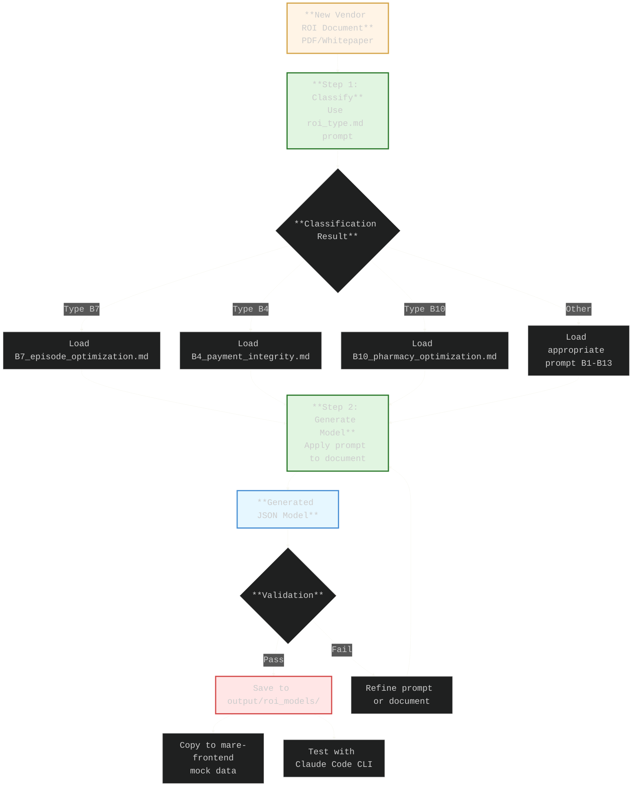

### Prompt Structure Breakdown

Each of the 13 model type prompts (B1-B13) follows this structure:

```mermaid
%%{init: {'theme':'dark', 'themeVariables': {'primaryColor':'#272822','primaryTextColor':'#F8F8F2','primaryBorderColor':'#75715E','lineColor':'#F8F8F2','secondaryColor':'#3E3D32','tertiaryColor':'#49483E','fontSize':'20px','fontFamily':'Monaco, Consolas, monospace'}}}%%
graph TD
    A[**Model Type Prompt**<br/>e.g., B7_episode_optimization.md] --> B[**Section 1: Instructions**<br/>~500 lines]
    A --> C[**Section 2: Domain Knowledge**<br/>~1000 lines]
    A --> D[**Section 3: Calculation Logic**<br/>~2000 lines]
    A --> E[**Section 4: Examples**<br/>~500 lines]

    B --> B1[Output format requirements]
    B --> B2[JSON schema validation]
    B --> B3[Model type-specific rules]

    C --> C1[Healthcare claims structures]
    C --> C2[ICD-10, CPT, DRG codes]
    C --> C3[Episode grouping methods]
    C --> C4[Industry benchmarks]

    D --> D1[Formula templates]
    D --> D2[SQL query patterns]
    D --> D3[Risk adjustment approaches]
    D --> D4[Configurable parameters]

    E --> E1[Sample inputs]
    E --> E2[Expected outputs]
    E --> E3[Edge case handling]

    style A fill:#fff4e6,stroke:#d4a54a,stroke-width:4px
    style B fill:#e1f5e1,stroke:#2d7a2d,stroke-width:3px
    style C fill:#e6f7ff,stroke:#4a90d4,stroke-width:3px
    style D fill:#ffe6e6,stroke:#d44a4a,stroke-width:3px
    style E fill:#f0e6ff,stroke:#904ad4,stroke-width:3px
```

### Generated Model JSON Structure

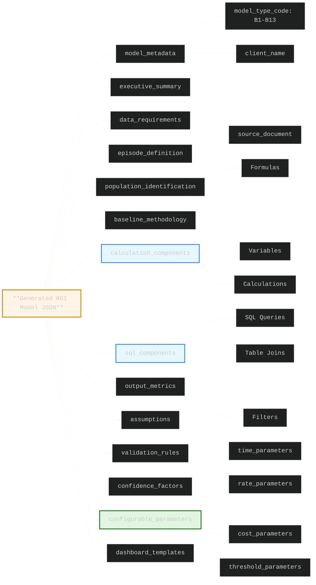

---

## 13 ROI Model Types

### Complete Type Matrix

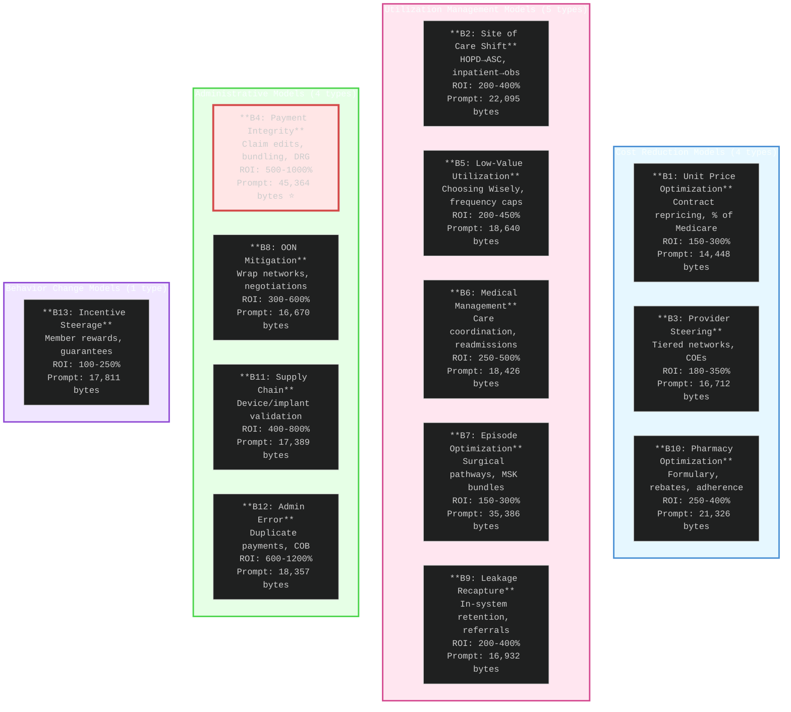

### Type Classification Decision Tree

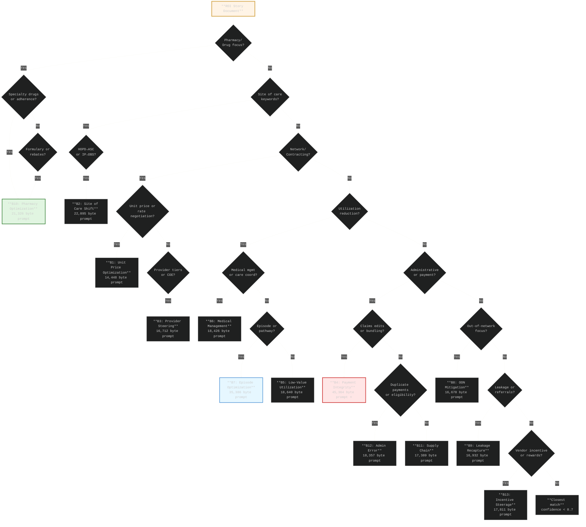

---

## Complete System Architecture

### Full Stack Integration

```mermaid
%%{init: {'theme':'dark', 'themeVariables': {'primaryColor':'#272822','primaryTextColor':'#F8F8F2','primaryBorderColor':'#75715E','lineColor':'#F8F8F2','secondaryColor':'#3E3D32','tertiaryColor':'#49483E','fontSize':'18px','fontFamily':'Monaco, Consolas, monospace'}}}%%
graph TB
    subgraph PromptRepo["**mare-triton-research-prompts** (Prompt Engineering Repository)"]
        direction TB
        PR_Tax[ROI Taxonomy<br/>configuration/roi_model_types_taxonomy.md]
        PR_Class[Classification Prompt<br/>prompts/roi_type.md<br/>7,548 bytes]
        PR_Base[Base Schema<br/>prompts/roi_models/_base_schema.md<br/>22,396 bytes]

        subgraph PR_Prompts["Model Generation Prompts (7,641 lines total)"]
            PR_B1[B1: Unit Price<br/>14,448 bytes]
            PR_B2[B2: Site of Care<br/>22,095 bytes]
            PR_B3[B3: Steerage<br/>16,712 bytes]
            PR_B4[B4: Payment Integrity<br/>45,364 bytes ⭐]
            PR_B5[B5: Low-Value<br/>18,640 bytes]
            PR_B6[B6: Medical Mgmt<br/>18,426 bytes]
            PR_B7[B7: Episode Opt<br/>35,386 bytes]
            PR_B8[B8: OON<br/>16,670 bytes]
            PR_B9[B9: Leakage<br/>16,932 bytes]
            PR_B10[B10: Pharmacy<br/>21,326 bytes]
            PR_B11[B11: Supply Chain<br/>17,389 bytes]
            PR_B12[B12: Admin Error<br/>18,357 bytes]
            PR_B13[B13: Incentive<br/>17,811 bytes]
        end

        PR_Samples[Sample ROI Documents<br/>sample_rois/*.pdf<br/>15+ documents]
        PR_Output[Generated Models<br/>output/roi_models/*.json<br/>30+ models]
    end

    subgraph Backend["**triton-agentic** (Backend Execution Engine)"]
        direction TB
        BE_API[FastAPI Server<br/>app.py]

        subgraph BE_Agents["Research Agents"]
            BE_Web[WebSearchAgent<br/>agents/web_search_agent.py]
            BE_Doc[DocumentAnalysisAgent<br/>agents/document_analysis_agent.py]
            BE_Class[Classification Engine<br/>Uses roi_type.md]
            BE_Model[Model Builder<br/>Uses B1-B13 prompts]
        end

        BE_DB[(PostgreSQL<br/>Agent Memory)]
        BE_S3[(S3 Storage<br/>Documents)]

        subgraph BE_Services["Core Services"]
            BE_Val[Validation Service<br/>JSON + Pydantic + Business]
            BE_Dash[Dashboard Generator<br/>5-10 variations per model]
            BE_Query[Query Builder<br/>SQL generation]
        end
    end

    subgraph Frontend["**mare-frontend** (UI Presentation Layer)"]
        direction TB
        FE_UI[Next.js Application<br/>src/app/]

        subgraph FE_Pages["Key Pages"]
            FE_Client[Client Management<br/>/admin/client-management/]
            FE_ROI[ROI Model Viewer<br/>/admin/client-management/id/roi-models/modelId]
            FE_Insights[Insights & Analytics<br/>/prospects/id/reports/insights/]
            FE_Dash[Dashboard Templates<br/>src/components/dashboard-templates/]
        end

        FE_Mock[Mock Data<br/>src/data/mock-data/roi-models/*.json<br/>53 models]
        FE_Types[TypeScript Types<br/>src/types/roi.ts<br/>714 lines]
    end

    %% Prompt Repository Connections
    PR_Class -.->|Loaded by| BE_Class
    PR_B1 -.->|Loaded by| BE_Model
    PR_B2 -.->|Loaded by| BE_Model
    PR_B3 -.->|Loaded by| BE_Model
    PR_B4 -.->|Loaded by| BE_Model
    PR_B5 -.->|Loaded by| BE_Model
    PR_B6 -.->|Loaded by| BE_Model
    PR_B7 -.->|Loaded by| BE_Model
    PR_B8 -.->|Loaded by| BE_Model
    PR_B9 -.->|Loaded by| BE_Model
    PR_B10 -.->|Loaded by| BE_Model
    PR_B11 -.->|Loaded by| BE_Model
    PR_B12 -.->|Loaded by| BE_Model
    PR_B13 -.->|Loaded by| BE_Model
    PR_Base -.->|Referenced by| BE_Model
    PR_Output ==>|Copied to| FE_Mock

    %% Backend Flow
    BE_API --> BE_Web
    BE_API --> BE_Doc
    BE_Web --> BE_Class
    BE_Doc --> BE_Class
    BE_Class --> BE_Model
    BE_Model --> BE_Val
    BE_Val --> BE_Dash
    BE_Model --> BE_Query
    BE_Web --> BE_DB
    BE_Doc --> BE_S3

    %% Backend to Frontend
    BE_Dash ==>|JSON Models| FE_Mock
    BE_Query ==>|SQL Queries| FE_ROI

    %% Frontend Internal
    FE_Mock --> FE_ROI
    FE_ROI --> FE_Dash
    FE_Dash --> FE_Insights

    style PromptRepo fill:#fff4e6,stroke:#d4a54a,stroke-width:4px
    style Backend fill:#e6f7ff,stroke:#4a90d4,stroke-width:4px
    style Frontend fill:#e1f5e1,stroke:#2d7a2d,stroke-width:4px
    style PR_B4 fill:#ffe6e6,stroke:#d44a4a,stroke-width:3px
    style PR_Prompts fill:#ffe6cc,stroke:#d4a54a,stroke-width:2px
    style BE_Agents fill:#cce6ff,stroke:#4a90d4,stroke-width:2px
    style BE_Services fill:#cce6ff,stroke:#4a90d4,stroke-width:2px
    style FE_Pages fill:#ccf5cc,stroke:#2d7a2d,stroke-width:2px
```

---

## Agent Ecosystem with Prompts

### Research Agent Architecture

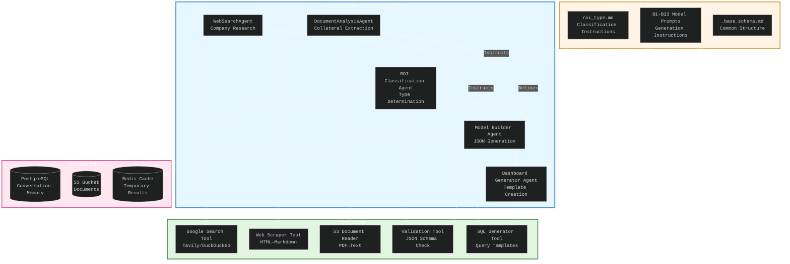

### Agent Lifecycle with Memory Management

```mermaid
%%{init: {'theme':'dark', 'themeVariables': {'primaryColor':'#272822','primaryTextColor':'#F8F8F2','primaryBorderColor':'#75715E','lineColor':'#F8F8F2','secondaryColor':'#3E3D32','tertiaryColor':'#49483E','fontSize':'20px','fontFamily':'Monaco, Consolas, monospace'}}}%%
sequenceDiagram
    participant API as FastAPI Endpoint
    participant Cache as Instruction Cache
    participant Prompt as Prompt Repository
    participant Agent as MareAgent Instance
    participant Memory as MemoryManager
    participant LLM as Claude/OpenAI
    participant DB as PostgreSQL

    Note over API,DB: Agent Creation Phase

    API->>Cache: Check for cached prompt
    alt Prompt not cached
        Cache->>Prompt: Load prompt file (B7_episode_optimization.md)
        Prompt-->>Cache: 35,386 bytes
        Cache->>Cache: Store in _instruction_cache
    end

    API->>Agent: create_agent(prompt, model)
    Agent->>Memory: Initialize MemoryManager(db)
    Memory->>DB: CREATE conversation session

    Note over API,DB: Execution Phase

    API->>Agent: run(message for ROI document analysis)
    Agent->>Memory: get_user_memories(user_id)
    Memory->>DB: SELECT * FROM user_memories WHERE user_id=?
    DB-->>Memory: [conversation history]
    Memory-->>Agent: Last 3 conversation turns

    Agent->>Agent: Build context = instructions + history + message
    Agent->>LLM: invoke(context)
    LLM-->>Agent: JSON response (10KB)

    Agent->>Memory: add_memory(user_msg, assistant_msg)
    Memory->>DB: INSERT INTO user_memories (user_id, message, response)

    Agent-->>API: Structured ROI Model JSON

    Note over API,DB: Cleanup Phase (❌ MISSING)

    API->>API: ❌ No cleanup() called
    Note over Agent,Memory: Agent + Memory persist in memory<br/>Potential leak: 2.4MB per agent

    style Agent fill:#ffe6e6,stroke:#d44a4a,stroke-width:3px
    style Memory fill:#ffe6e6,stroke:#d44a4a,stroke-width:3px
```

---

## End-to-End Workflows

### Complete ROI Model Generation Flow

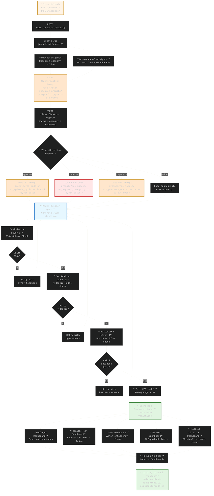

### Prompt Loading & Caching Flow

```mermaid
%%{init: {'theme':'dark', 'themeVariables': {'primaryColor':'#272822','primaryTextColor':'#F8F8F2','primaryBorderColor':'#75715E','lineColor':'#F8F8F2','secondaryColor':'#3E3D32','tertiaryColor':'#49483E','fontSize':'20px','fontFamily':'Monaco, Consolas, monospace'}}}%%
sequenceDiagram
    participant Agent as Model Builder Agent
    participant Cache as Instruction Cache<br/>(In-Memory Dict)
    participant FS as File System<br/>(mare-triton-research-prompts)
    participant LLM as Claude Sonnet 4

    Note over Agent,LLM: First Request for B7 Model

    Agent->>Cache: Get prompt for B7
    Cache->>Cache: Check instruction cache for B7
    Cache-->>Agent: ❌ Not found

    Agent->>FS: Read prompts/roi_models/B7_episode_optimization.md
    FS-->>Agent: 35,386 bytes (full prompt)

    Agent->>Cache: Store B7 prompt in cache
    Cache->>Cache: Cache size: 35KB

    Agent->>LLM: Send prompt + ROI document
    Note over Agent,LLM: Context: 35KB prompt + 200KB document = 235KB
    LLM-->>Agent: Generated ROI Model JSON (50KB)

    Note over Agent,LLM: Second Request for B7 Model (same agent)

    Agent->>Cache: Get prompt for B7
    Cache-->>Agent: ✅ Found in cache (35KB)
    Note over Agent,Cache: No file I/O needed

    Agent->>LLM: Send cached prompt + new document
    LLM-->>Agent: Generated ROI Model JSON

    Note over Agent,LLM: Request for B4 Model (same agent)

    Agent->>Cache: Get prompt for B4
    Cache-->>Agent: ❌ Not found

    Agent->>FS: Read prompts/roi_models/B4_payment_integrity.md
    FS-->>Agent: 45,364 bytes ⭐ (largest prompt)

    Agent->>Cache: Store B4 prompt in cache
    Cache->>Cache: Cache size: 80KB (B7 + B4)
    Note over Cache: ⚠️ Cache grows indefinitely

    Agent->>LLM: Send prompt + document
    LLM-->>Agent: Generated ROI Model JSON

    style Cache fill:#ffe6e6,stroke:#d44a4a,stroke-width:3px
    style FS fill:#ffe6cc,stroke:#d4a54a,stroke-width:3px
```

---

## Database & Storage

### PostgreSQL Schema for ROI Models

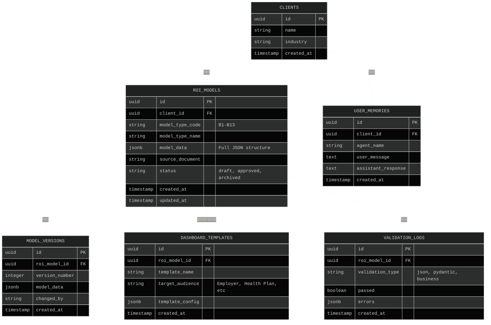

### S3 Storage Structure

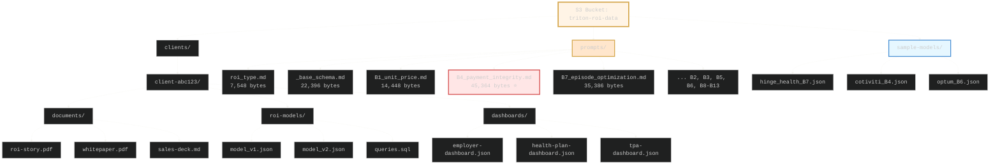

---

## Implementation Guide

### Phase 1: Set Up Prompt Repository Integration

#### Step 1.1: Clone Prompt Repository

```bash
cd /home/yashrajshres
git clone <repo-url> mare-triton-research-prompts
cd mare-triton-research-prompts

# Verify structure
ls -la prompts/roi_models/
# Should see:
# - _base_schema.md (22,396 bytes)
# - B1_unit_price_optimization.md (14,448 bytes)
# - B2_site_of_care_shift.md (22,095 bytes)
# - ... B3-B13 (7,641 lines total)
```

#### Step 1.2: Configure Prompt Loader in triton-agentic

```python
# triton-agentic/core/config/settings.py

from pathlib import Path

class Settings:
    # ... existing settings ...

    # Prompt repository path
    PROMPT_REPO_PATH = Path(__file__).parent.parent.parent.parent / "mare-triton-research-prompts"

    # Prompt file paths
    CLASSIFICATION_PROMPT_PATH = PROMPT_REPO_PATH / "prompts" / "roi_type.md"
    MODEL_PROMPTS_DIR = PROMPT_REPO_PATH / "prompts" / "roi_models"
    BASE_SCHEMA_PATH = MODEL_PROMPTS_DIR / "_base_schema.md"

    # Verify paths on startup
    def validate_prompt_paths(self):
        if not self.PROMPT_REPO_PATH.exists():
            raise FileNotFoundError(f"Prompt repository not found at {self.PROMPT_REPO_PATH}")
        if not self.CLASSIFICATION_PROMPT_PATH.exists():
            raise FileNotFoundError(f"Classification prompt not found")
        if not self.MODEL_PROMPTS_DIR.exists():
            raise FileNotFoundError(f"Model prompts directory not found")

config = Settings()
config.validate_prompt_paths()
```

#### Step 1.3: Implement Prompt Caching with Cleanup

```python
# triton-agentic/agents/base/base_agent.py

from functools import lru_cache
from pathlib import Path
from typing import Optional

class BaseAgentTemplate(ABC):
    """Abstract base class for agent templates with improved caching."""

    def __init__(self):
        """Initialize the agent template."""
        self._allowed_s3_paths = None
        self.template_dir = config.MODEL_PROMPTS_DIR
        # Use LRU cache instead of unbounded dict
        self._load_instruction_file = lru_cache(maxsize=32)(self._load_instruction_file_impl)

    def _load_instruction_file_impl(self, filename: str) -> str:
        """Load instruction file (cached implementation).

        Args:
            filename: Name of the file to load (relative to prompts directory)

        Returns:
            File contents as string
        """
        file_path = self.template_dir / filename
        if file_path.exists():
            logger.debug(f"Loading prompt file: {filename} ({file_path.stat().st_size} bytes)")
            return file_path.read_text()
        else:
            logger.warning(f"Prompt file not found: {file_path}")
            return ""

    def cleanup(self):
        """Clean up cached prompts."""
        if hasattr(self, '_load_instruction_file'):
            self._load_instruction_file.cache_clear()
            logger.debug("Cleared prompt cache")
```

### Phase 2: Implement ROI Classification Agent

```python
# triton-agentic/agents/roi_classification_agent.py

from agents.base.base_agent import BaseAgentTemplate, MareAgent
from core.config.settings import config
from core.monitoring.logger import get_logger

logger = get_logger(__name__)

class ROIClassificationAgentTemplate(BaseAgentTemplate):
    """Agent template for classifying ROI stories into 13 types."""

    def __init__(self):
        super().__init__()
        self.classification_prompt_path = config.CLASSIFICATION_PROMPT_PATH

    def get_agent_config(self) -> Dict[str, Any]:
        """Get agent configuration."""
        return {
            "markdown": False,
            "add_history_to_context": True,
            "num_history_runs": 1,
        }

    def get_tools(self) -> List:
        """No tools needed for classification."""
        return []

    def get_instructions(self) -> str:
        """Load classification instructions from prompt repository."""
        if not self.classification_prompt_path.exists():
            raise FileNotFoundError(
                f"Classification prompt not found at {self.classification_prompt_path}"
            )

        prompt_text = self.classification_prompt_path.read_text()
        logger.info(
            f"Loaded classification prompt: {len(prompt_text)} characters, "
            f"{self.classification_prompt_path.stat().st_size} bytes"
        )

        return prompt_text

    def get_description(self) -> str:
        """Get agent description."""
        return (
            "ROI Classification Agent - Classifies healthcare ROI stories into "
            "1 of 13 distinct model types using mare-triton-research-prompts taxonomy"
        )

def create_roi_classification_agent(
    name: str = "ROIClassificationAgent",
    model: Any = None,
    **kwargs
) -> MareAgent:
    """Create ROI classification agent instance."""
    from core.models.model_factory import get_default_model

    if model is None:
        model = get_default_model()

    template = ROIClassificationAgentTemplate()
    agent = template.create_agent(name=name, model=model, **kwargs)

    logger.info(f"Created {name} with classification prompt from repository")
    return agent
```

### Phase 3: Implement Model Builder Agent

```python
# triton-agentic/agents/roi_model_builder_agent.py

from agents.base.base_agent import BaseAgentTemplate, MareAgent
from core.config.settings import config
from core.monitoring.logger import get_logger

logger = get_logger(__name__)

class ROIModelBuilderAgentTemplate(BaseAgentTemplate):
    """Agent template for building ROI models from classified stories."""

    def __init__(self, model_type_code: str):
        """Initialize with specific model type.

        Args:
            model_type_code: One of B1-B13
        """
        super().__init__()
        self.model_type_code = model_type_code
        self.model_prompt_path = self._get_model_prompt_path(model_type_code)
        self.base_schema_path = config.BASE_SCHEMA_PATH

    def _get_model_prompt_path(self, model_type_code: str) -> Path:
        """Get prompt file path for model type."""
        prompt_map = {
            "B1": "B1_unit_price_optimization.md",
            "B2": "B2_site_of_care_shift.md",
            "B3": "B3_steerage.md",
            "B4": "B4_payment_integrity.md",
            "B5": "B5_low_value_utilization.md",
            "B6": "B6_medical_management.md",
            "B7": "B7_episode_optimization.md",
            "B8": "B8_oon_mitigation.md",
            "B9": "B9_leakage_recapture.md",
            "B10": "B10_pharmacy_optimization.md",
            "B11": "B11_device_implant.md",
            "B12": "B12_admin_error.md",
            "B13": "B13_incentive_steerage.md",
        }

        if model_type_code not in prompt_map:
            raise ValueError(f"Invalid model type code: {model_type_code}")

        filename = prompt_map[model_type_code]
        path = config.MODEL_PROMPTS_DIR / filename

        if not path.exists():
            raise FileNotFoundError(f"Model prompt not found: {path}")

        return path

    def get_agent_config(self) -> Dict[str, Any]:
        """Get agent configuration."""
        return {
            "markdown": False,
            "add_history_to_context": True,
            "num_history_runs": 1,
        }

    def get_tools(self) -> List:
        """No tools needed for model building."""
        return []

    def get_instructions(self) -> str:
        """Load model-specific prompt from repository."""
        # Load base schema
        base_schema = self.base_schema_path.read_text()
        base_schema_size = self.base_schema_path.stat().st_size

        # Load model-specific prompt
        model_prompt = self.model_prompt_path.read_text()
        model_prompt_size = self.model_prompt_path.stat().st_size

        logger.info(
            f"Loaded prompts for {self.model_type_code}: "
            f"base schema ({base_schema_size} bytes) + "
            f"model prompt ({model_prompt_size} bytes) = "
            f"{base_schema_size + model_prompt_size} bytes total"
        )

        # Combine base schema + model-specific instructions
        combined_prompt = f"""
{base_schema}

---

{model_prompt}
"""

        return combined_prompt

    def get_description(self) -> str:
        """Get agent description."""
        return (
            f"ROI Model Builder Agent ({self.model_type_code}) - "
            f"Generates complete ROI model JSON using prompt from "
            f"mare-triton-research-prompts repository"
        )

def create_roi_model_builder_agent(
    model_type_code: str,
    name: str = None,
    model: Any = None,
    **kwargs
) -> MareAgent:
    """Create ROI model builder agent for specific type.

    Args:
        model_type_code: One of B1-B13
        name: Agent name (defaults to "ROIModelBuilderAgent_{type}")
        model: LLM model instance
        **kwargs: Additional agent parameters

    Returns:
        MareAgent instance configured for model building
    """
    from core.models.model_factory import get_default_model

    if model is None:
        model = get_default_model()

    if name is None:
        name = f"ROIModelBuilderAgent_{model_type_code}"

    template = ROIModelBuilderAgentTemplate(model_type_code=model_type_code)
    agent = template.create_agent(name=name, model=model, **kwargs)

    logger.info(
        f"Created {name} for {model_type_code} using prompt: "
        f"{template.model_prompt_path.name}"
    )
    return agent
```

### Phase 4: API Integration

```python
# triton-agentic/api/routes/roi_models.py

from fastapi import APIRouter, HTTPException, BackgroundTasks
from agents.roi_classification_agent import create_roi_classification_agent
from agents.roi_model_builder_agent import create_roi_model_builder_agent

router = APIRouter(prefix="/roi-models", tags=["roi_models"])

@router.post("/generate", status_code=202)
async def generate_roi_model(
    request: ROIModelGenerationRequest,
    background_tasks: BackgroundTasks
):
    """
    Generate ROI model from story document.

    Process:
    1. Classify ROI story → determine model type (B1-B13)
    2. Load appropriate prompt from mare-triton-research-prompts
    3. Generate JSON model using Model Builder Agent
    4. Validate model (4 layers)
    5. Generate 5-10 dashboard variations

    Returns job ID for status tracking.
    """
    job_id = f"roi_model_{uuid.uuid4().hex[:12]}"

    # Create job record
    roi_model_jobs[job_id] = {
        "job_id": job_id,
        "status": "pending",
        "created_at": datetime.utcnow(),
        "request": request.dict(),
    }

    # Execute in background
    background_tasks.add_task(
        execute_roi_model_generation,
        job_id,
        request
    )

    return {
        "job_id": job_id,
        "status": "pending",
        "message": "ROI model generation initiated"
    }

async def execute_roi_model_generation(
    job_id: str,
    request: ROIModelGenerationRequest
):
    """Execute ROI model generation workflow."""
    try:
        # Step 1: Classify ROI story
        logger.info(f"[{job_id}] Step 1: Classifying ROI story")
        classification_agent = create_roi_classification_agent()

        classification_message = f"""
Classify the following ROI story:

Company: {request.company_name}
Document: {request.roi_story_text or request.document_url}

Return JSON with model_type_code (B1-B13) and confidence score.
"""

        classification_result = classification_agent.run(classification_message)
        model_type_code = classification_result["model_type_code"]
        confidence = classification_result["confidence"]

        logger.info(
            f"[{job_id}] Classification complete: {model_type_code} "
            f"(confidence: {confidence})"
        )

        # Cleanup classification agent
        if hasattr(classification_agent, 'cleanup'):
            classification_agent.cleanup()
        del classification_agent

        # Step 2: Build ROI model
        logger.info(f"[{job_id}] Step 2: Building {model_type_code} model")
        model_builder = create_roi_model_builder_agent(
            model_type_code=model_type_code
        )

        model_message = f"""
Generate a complete ROI model for:

Company: {request.company_name}
Model Type: {model_type_code}
ROI Story: {request.roi_story_text}

Return JSON matching the schema defined in _base_schema.md.
"""

        roi_model = model_builder.run(model_message)

        logger.info(f"[{job_id}] Model generation complete")

        # Cleanup model builder agent
        if hasattr(model_builder, 'cleanup'):
            model_builder.cleanup()
        del model_builder

        # Step 3: Validate model
        logger.info(f"[{job_id}] Step 3: Validating model (4 layers)")
        validation_result = validate_roi_model(roi_model)

        if not validation_result["valid"]:
            raise ValueError(f"Model validation failed: {validation_result['errors']}")

        # Step 4: Save model
        logger.info(f"[{job_id}] Step 4: Saving model to database")
        saved_model_id = save_roi_model_to_db(roi_model, request.client_id)

        # Update job status
        roi_model_jobs[job_id].update({
            "status": "completed",
            "completed_at": datetime.utcnow(),
            "model_id": saved_model_id,
            "model_type_code": model_type_code,
            "confidence": confidence,
        })

        logger.info(f"[{job_id}] ROI model generation completed successfully")

    except Exception as e:
        logger.error(f"[{job_id}] ROI model generation failed: {e}", exc_info=True)
        roi_model_jobs[job_id].update({
            "status": "failed",
            "completed_at": datetime.utcnow(),
            "error": str(e),
        })
```

---

## Testing & Validation

### Prompt Repository Testing Workflow

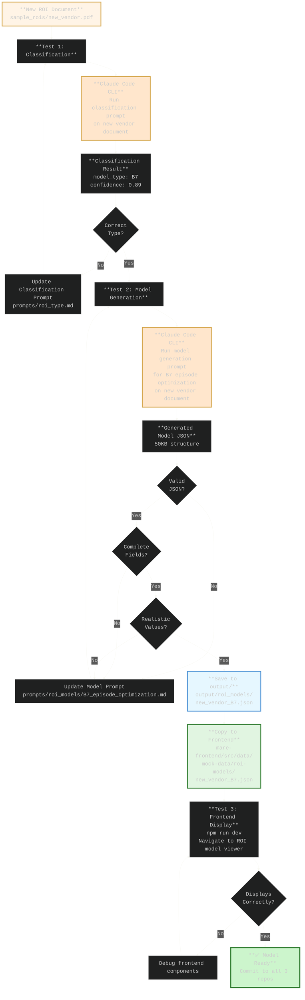

---

## Performance & Scalability

### Memory Management with Prompt Caching

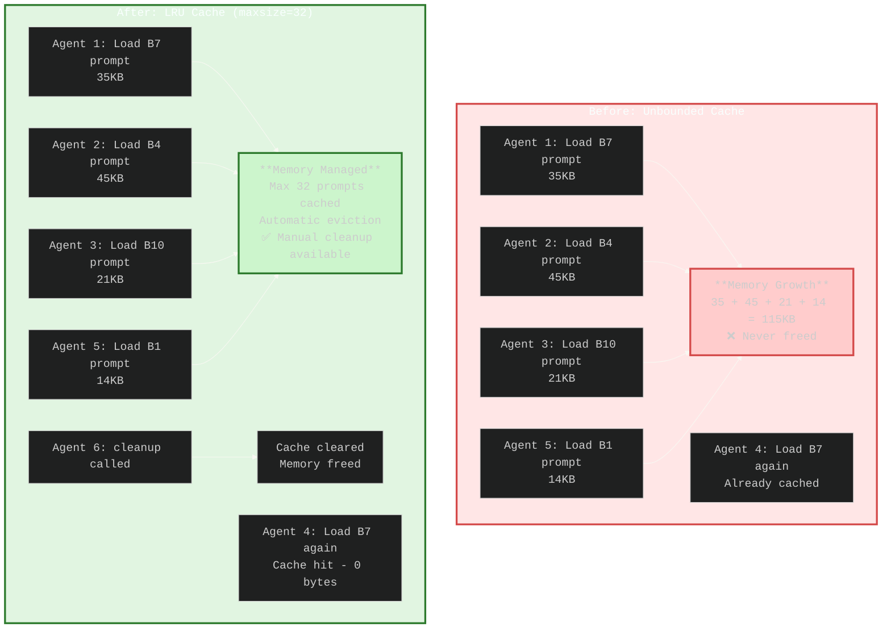

---

## Additional Workflows & Diagrams

### Vendor Onboarding Complete Workflow

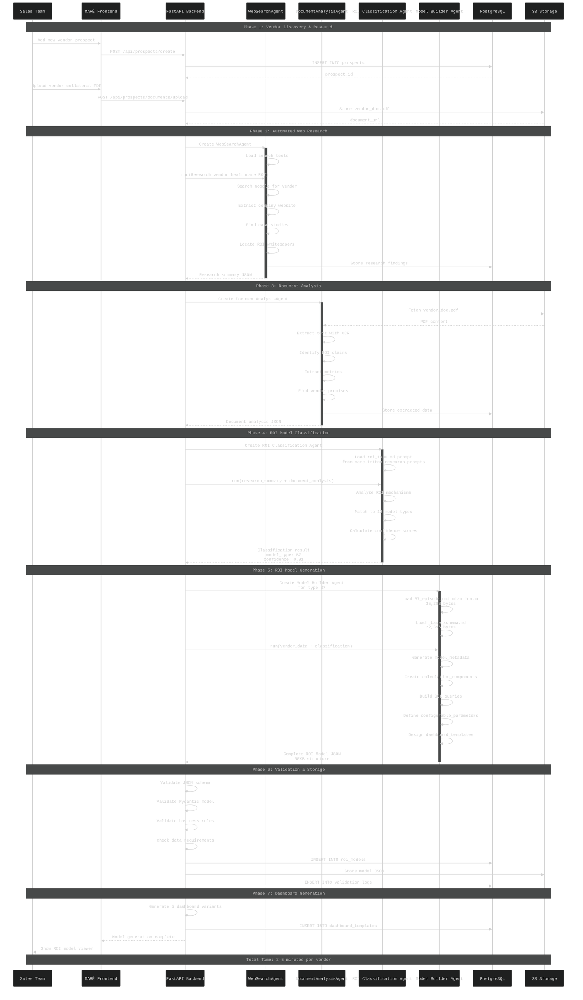

### Multi-Vendor Batch Processing Flow

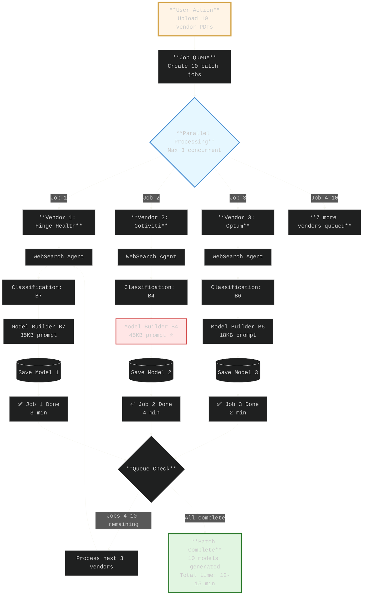

### Dashboard Template Generation Sequence

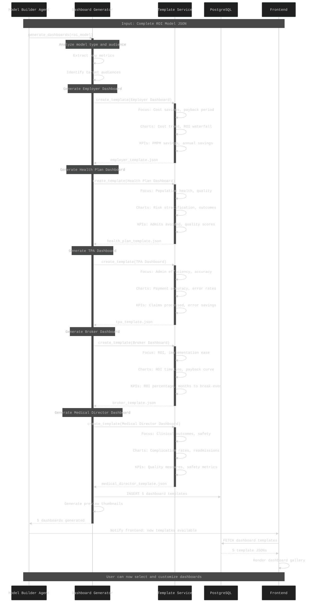

### Model Validation Four-Layer Architecture

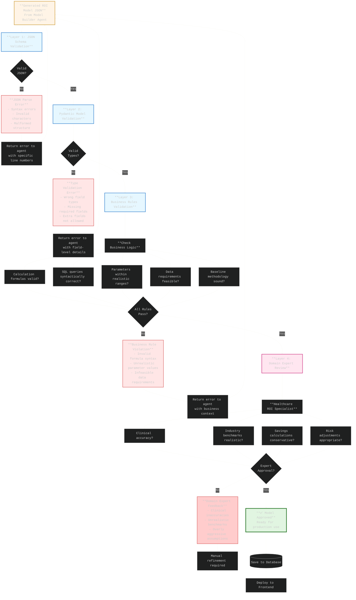

### Real-Time Model Execution Sequence

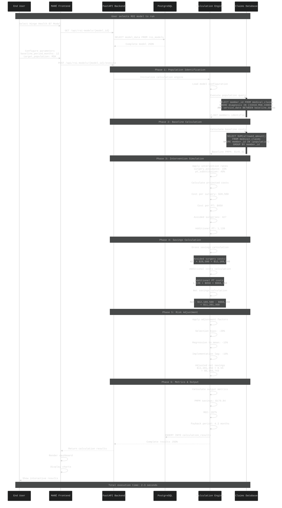

### Error Handling & Retry Logic Flow

```mermaid
%%{init: {'theme':'dark', 'themeVariables': {'primaryColor':'#272822','primaryTextColor':'#F8F8F2','primaryBorderColor':'#75715E','lineColor':'#F8F8F2','secondaryColor':'#3E3D32','tertiaryColor':'#49483E','fontSize':'20px','fontFamily':'Monaco, Consolas, monospace'}}}%%
flowchart TD
    Start[**Agent.run called**<br/>Generate ROI model] --> Try1[**Attempt 1**<br/>Send prompt to LLM]

    Try1 --> Check1{Success?}

    Check1 -->|Yes| Validate1[Validate response]
    Validate1 --> Valid1{Valid<br/>JSON?}

    Valid1 -->|Yes| Success[**✅ Return Result**]

    Valid1 -->|No| Log1[Log validation error]
    Log1 --> Retry1{Retries < 3?}

    Check1 -->|No| Error1[**LLM Error**]
    Error1 --> ErrorType1{Error<br/>Type?}

    ErrorType1 -->|Rate Limit| Wait1[Wait with backoff<br/>2^attempt × 1s]
    Wait1 --> Retry1

    ErrorType1 -->|Timeout| Log2[Log timeout]
    Log2 --> Retry1

    ErrorType1 -->|Auth Error| Fatal1[**❌ Fatal Error**<br/>Invalid credentials]

    ErrorType1 -->|Context Length| Truncate1[Truncate input<br/>Remove history]
    Truncate1 --> Retry1

    Retry1 -->|Yes| Try2[**Attempt 2**<br/>Retry with error context]
    Retry1 -->|No| Failure[**❌ Max Retries**<br/>Return error to user]

    Try2 --> Check2{Success?}
    Check2 -->|Yes| Validate2[Validate response]
    Validate2 --> Valid2{Valid<br/>JSON?}
    Valid2 -->|Yes| Success
    Valid2 -->|No| Log3[Log validation error]
    Log3 --> Retry2{Retries < 3?}

    Check2 -->|No| Error2[**LLM Error**]
    Error2 --> ErrorType2{Error<br/>Type?}
    ErrorType2 -->|Rate Limit| Wait2[Wait with backoff<br/>2^2 × 1s = 4s]
    Wait2 --> Retry2
    ErrorType2 -->|Timeout| Retry2
    ErrorType2 -->|Auth Error| Fatal1
    ErrorType2 -->|Context Length| Truncate2[Truncate further]
    Truncate2 --> Retry2

    Retry2 -->|Yes| Try3[**Attempt 3**<br/>Final retry]
    Retry2 -->|No| Failure

    Try3 --> Check3{Success?}
    Check3 -->|Yes| Validate3[Validate response]
    Validate3 --> Valid3{Valid<br/>JSON?}
    Valid3 -->|Yes| Success
    Valid3 -->|No| Failure

    Check3 -->|No| Failure

    Failure --> Cleanup[Cleanup agent resources]
    Cleanup --> Notify[Notify user & log error]

    style Start fill:#fff4e6,stroke:#d4a54a,stroke-width:3px
    style Success fill:#e1f5e1,stroke:#2d7a2d,stroke-width:4px
    style Failure fill:#ffe6e6,stroke:#d44a4a,stroke-width:3px
    style Fatal1 fill:#ffcccc,stroke:#d44a4a,stroke-width:4px
    style Try1 fill:#e6f7ff,stroke:#4a90d4,stroke-width:2px
    style Try2 fill:#e6f7ff,stroke:#4a90d4,stroke-width:2px
    style Try3 fill:#e6f7ff,stroke:#4a90d4,stroke-width:2px
```

### Model Type Selection Intelligence

```mermaid
%%{init: {'theme':'dark', 'themeVariables': {'primaryColor':'#272822','primaryTextColor':'#F8F8F2','primaryBorderColor':'#75715E','lineColor':'#F8F8F2','secondaryColor':'#3E3D32','tertiaryColor':'#49483E','fontSize':'18px','fontFamily':'Monaco, Consolas, monospace'}}}%%
sequenceDiagram
    participant Doc as Vendor Document
    participant Extract as Text Extractor
    participant NLP as NLP Analyzer
    participant Class as Classification Agent
    participant Prompt as roi_type.md Prompt
    participant Logic as Decision Logic
    participant Result as Classification Result

    Note over Doc,Result: Input: Vendor ROI whitepaper

    Doc->>Extract: Parse PDF/HTML
    Extract->>Extract: OCR if needed
    Extract->>Extract: Extract plain text
    Extract-->>NLP: Full document text

    Note over NLP: Preprocessing & Feature Extraction

    NLP->>NLP: Tokenize sentences
    NLP->>NLP: Extract key phrases
    NLP->>NLP: Identify ROI keywords

    NLP->>NLP: Find keyword matches
    Note over NLP: Keywords found:<br/>- "episode of care" (8 times)<br/>- "surgery avoidance" (5 times)<br/>- "MSK pathway" (12 times)<br/>- "complications" (7 times)

    NLP->>NLP: Calculate keyword density
    NLP->>NLP: Extract ROI metrics
    NLP-->>Class: Preprocessed features

    Note over Class: LLM-Based Classification

    Class->>Prompt: Load classification instructions
    Prompt-->>Class: 7,548 byte prompt with:<br/>- 13 model type definitions<br/>- Keyword matching rules<br/>- Overlap resolution logic

    Class->>Class: Build LLM context
    Note over Class: Combine:<br/>prompt + document + features

    Class->>Class: Invoke Claude Sonnet 4
    Note over Class: LLM analyzes:<br/>1. Primary ROI mechanism<br/>2. Secondary value drivers<br/>3. Savings calculation type<br/>4. Target population

    Class->>Logic: Process LLM output

    Note over Logic: Decision Tree Traversal

    Logic->>Logic: Q1: Pharmacy focus?<br/>→ No (no drug keywords)
    Logic->>Logic: Q2: Site of care shift?<br/>→ No (no HOPD/ASC mention)
    Logic->>Logic: Q3: Utilization reduction?<br/>→ Yes (surgery avoidance)
    Logic->>Logic: Q4: Episode or pathway?<br/>→ Yes (episode 8x, pathway 12x)

    Logic->>Logic: Match to B7 Episode Optimization

    Note over Logic: Confidence Calculation

    Logic->>Logic: Keyword match score: 0.92
    Logic->>Logic: Mechanism alignment: 0.95
    Logic->>Logic: Exclusion check: 0.88
    Logic->>Logic: Overall confidence: 0.91

    Logic->>Result: Build classification result

    Result->>Result: model_type_code: B7
    Result->>Result: model_type_name: Episode optimization
    Result->>Result: confidence: 0.91
    Result->>Result: primary_mechanism: Standardized MSK pathways
    Result->>Result: key_phrases: episode, pathway, surgery avoidance

    Result-->>Class: Return classification

    Note over Doc,Result: Classification complete in 1-2 seconds
```

---

## Summary

### Three-Repository Integration

| Repository | Role | Key Integration Points |
|------------|------|------------------------|
| **mare-triton-research-prompts** | Prompt Engineering | Provides 7,641 lines of prompts<br/>Defines taxonomy<br/>Contains 30+ example models |
| **triton-agentic** | Execution Engine | Loads prompts dynamically<br/>Runs agents with prompts<br/>Generates new models |
| **mare-frontend** | Presentation Layer | Displays generated models<br/>Uses 53 mock models<br/>Matches prompt schema |

### Data Flow Summary

```
User uploads ROI document
  ↓
triton-agentic loads classification prompt from mare-triton-research-prompts/prompts/roi_type.md
  ↓
Classification Agent determines model type (B1-B13)
  ↓
triton-agentic loads model-specific prompt from mare-triton-research-prompts/prompts/roi_models/B{X}.md
  ↓
Model Builder Agent generates JSON using prompt
  ↓
Validation (4 layers)
  ↓
Save to PostgreSQL + S3
  ↓
Copy to mare-frontend/src/data/mock-data/roi-models/*.json
  ↓
Display in MARÉ UI
```

### Key Metrics

- **Prompt Library Size**: 7,641 lines across 14 files
- **Generated Models**: 30+ real-world examples in repository
- **Model Types**: 13 distinct healthcare ROI categories
- **Frontend Integration**: 53 models in mare-frontend mock data
- **Largest Prompt**: B4 Payment Integrity (45,364 bytes)
- **Average Prompt Size**: ~550 lines per model type

---

**END OF DOCUMENT**
